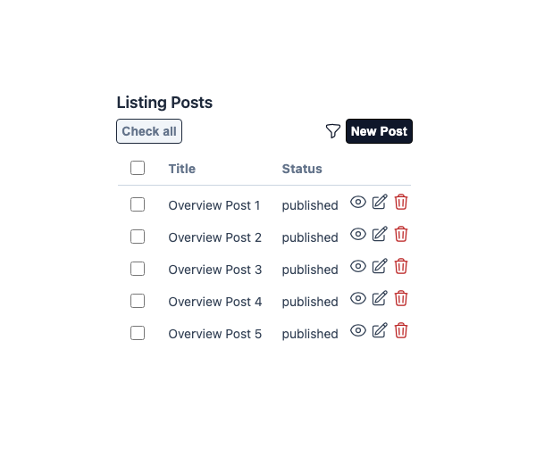
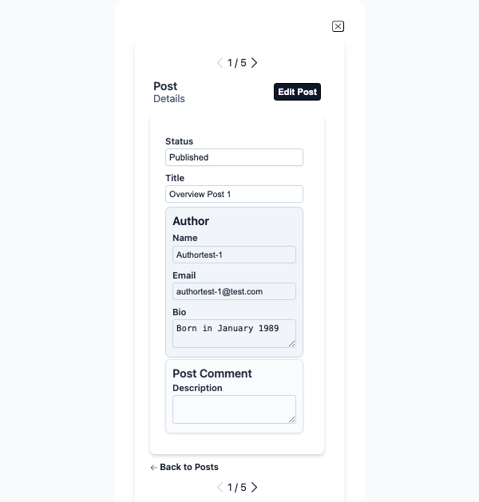
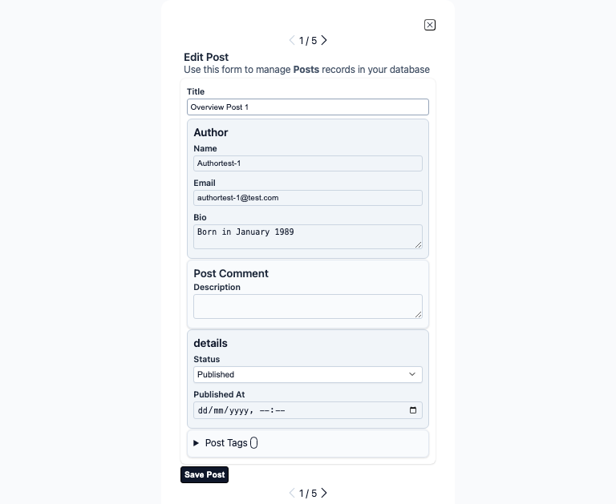
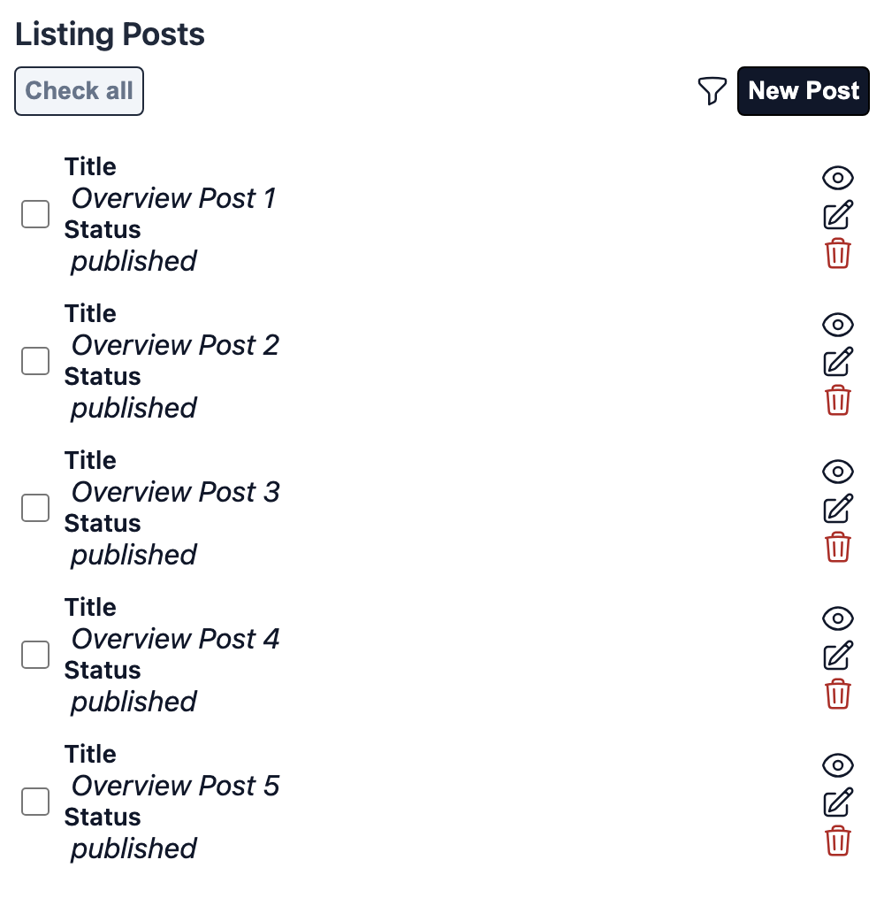
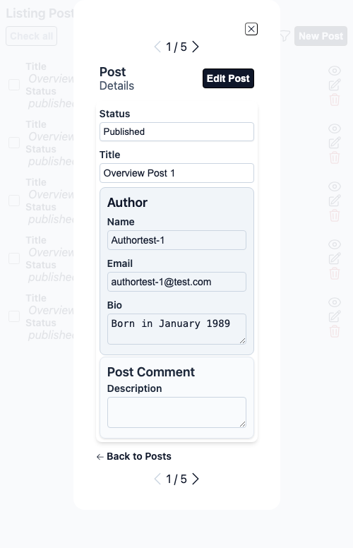
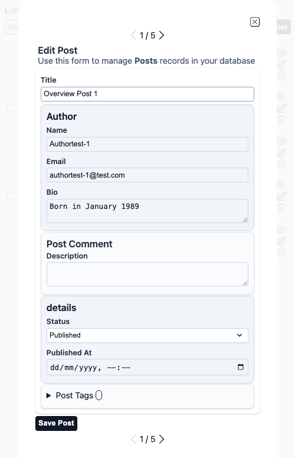

# Ash Framework Integration

Aurora UIX is a powerful low-code framework for building dynamic CRUD UIs in Phoenix LiveView applications. 
While Aurora UIX works perfectly with traditional Phoenix Contexts and Ecto schemas, it also provides **integration** with the [Ash Framework](https://ash-hq.org/).

This guide explains how to leverage Aurora UIX's Ash integration as an alternative backend to the standard Context-based approach.

## Overview

Aurora UIX is designed with a flexible backend architecture that supports multiple data access patterns. 
Aurora UIX seamlessly adapts to use Ash as the backend, transforming your existing Ash resources into complete UI implementations **without requiring any changes to your Ash resources**.

### Why Aurora UIX with Ash?

If your application already uses Ash Framework, Aurora UIX provides:

- **Zero Duplication** - Reuse your existing Ash resource definitions and actions, mildly aligned to Ash concept 'Model your domain, derive the rest'
- **Automatic Action Discovery** - Aurora UIX detects and uses your defined Ash actions
- **Declarative Configuration** - No need to write Context functions or custom queries
- **Type Safety** - Leverages Ash's type system for automatic field inference
- **Constraint Awareness** - Respects Ash constraints like `:one_of` for enum fields
- **Flexible Backend Use** - Use Ash and Context-based resources in the same Aurora UIX application

## Prerequisites

Before enabling Aurora UIX's Ash integration, ensure you have:

1. **Aurora UIX** installed and working (see [Getting Started](../introduction/getting_started.md))
2. **Ash Framework** installed and configured in your Phoenix project
3. **Ash Resources** with defined actions and attributes
4. **An Ash Domain** (optional but recommended) organizing your resources

### Required Dependencies

Besides Aurora UIX, you'll need to add Ash dependencies for using it as a backend for UI rendering. In your `mix.exs`:

```elixir
def deps do
  [
    {:aurora_uix, "~> 0.1.4"},  # Main framework
    {:ash, "~> 3.0"},           # If use Ash as backend
    {:ash_postgres, "~> 2.0"}   # Needed if using postgres as your data layer. Add any other data layer required by your backend
  ]
end
```

## Basic Configuration

### Step 1: Define Your Ash Resource (or Use Existing)

If you already have Ash resources, skip to Step 3. Otherwise, create an Ash resource with standard or customized CRUD actions:

```elixir
defmodule Aurora.Uix.Guides.Blog.Post do
  use Ash.Resource,
    data_layer: AshPostgres.DataLayer,
    domain: Aurora.Uix.Guides.Blog

  postgres do
    table("posts")
    repo(Aurora.Uix.Repo)
  end

  attributes do
    uuid_primary_key(:id)

    attribute(:title, :string)
    attribute(:content, :string)
    attribute(:published_at, :utc_datetime)

    attribute :status, :atom do
      constraints one_of: [:draft, :published, :archived]
      default :draft
    end

    create_timestamp(:inserted_at)
    update_timestamp(:updated_at)
  end

  relationships do
    belongs_to(:author, Aurora.Uix.Guides.Blog.Author)
    belongs_to(:category, Aurora.Uix.Guides.Blog.Category)
  end

  actions do
    default_accept [:title, :content, :status, :author_id, :category_id]
    defaults [:create, :read, :destroy, :update]
  end
end
```

### Step 2: Define Your Ash Domain

Organize resources in an Ash domain:

```elixir
defmodule Aurora.Uix.Guides.Blog do
  use Ash.Domain

  resources do
    resource Aurora.Uix.Guides.Blog.Post
    resource Aurora.Uix.Guides.Blog.Author
    
    resource Aurora.Uix.Guides.Blog.Category do
      define :list_categories, action: :read
    end
  end
end
```

### Step 3: Configure Aurora UIX Resource Metadata

Create a module to configure your UI:

```elixir
defmodule Aurora.UixWeb.Guides.AshOverview do
  use Aurora.Uix

  alias Aurora.Uix.Guides.Blog.Author
  alias Aurora.Uix.Guides.Blog.Category
  alias Aurora.Uix.Guides.Blog.Comment
  alias Aurora.Uix.Guides.Blog.Post
  alias Aurora.Uix.Guides.Blog.Tag

  auix_resource_metadata(:author, ash_resource: Author) do
    field :bio, html_type: :textarea
  end

  auix_resource_metadata(:category, ash_resource: Category)

  auix_resource_metadata(:post__comment, ash_resource: Comment) do
    field :description, html_type: :textarea
  end

  auix_resource_metadata(:post, ash_resource: Post, order_by: :title)

  auix_resource_metadata(:tag, ash_resource: Tag)

  auix_create_ui do
    show_layout :author do
      stacked([:name, :email, :bio])
    end

    edit_layout :author do
      inline([:name, :email, :bio])
    end

    index_columns(:post, [:title, :author, :status])

    show_layout :post do
      stacked([:status, :title, :author, :comment])
    end

    edit_layout :post do
      stacked do
        inline([:title])
        inline([:author])
        inline([:comment])

        group "details" do
          stacked([:status, :published_at])
        end

        inline([:tags])
      end
    end
  end
end
```

### Step 4: Add to Router

```elixir
defmodule Aurora.UixWeb.Router do
  use Aurora.UixWeb, :router
  import Aurora.Uix.Router

  scope "/guides-overview", Aurora.UixWeb.Guides do
    pipe_through :browser

    auix_live_resources("/posts", AshOverview.Post)
    auix_live_resources("/authors", AshOverview.Author)
    auix_live_resources("/categories", AshOverview.Category)
    auix_live_resources("/tags", AshOverview.Tag)
  end
end
```

That's it! Aurora UIX will generate complete CRUD interfaces using your existing Ash actions, without requiring any changes to your Ash resources or domain definitions.

Here are the generated items

#### Desktop generation

<div align="center">
    
</div>

---

<div align="center">
    
</div>

---

<div align="center">
    
</div>

#### Mobile generation

<div align="center">
    
</div>

---

<div align="center">
    
</div>

---

<div align="center">
    
</div>
## Configuration Options

### Resource Metadata Options

When configuring an Ash resource, you can use these options:

#### Required Options

- `:ash_resource` (module()) - Your Ash resource module

#### Optional Options

- `:order_by` (atom() | list() | keyword()) - Default ordering for index views
- `:type` (atom()) - The type of backend is determined based on the `ash_resource` module.
    Setting this value manually will bypass the detection mechanism, and it is useful to provide a custom backend

#### Alternative Syntax

You can also use `:schema` as an alias for `:ash_resource`:

```elixir
# These are equivalent
auix_resource_metadata :user, ash_resource: User
auix_resource_metadata :user, schema: User, context: Accounts
```

### Examples

#### Without Domain

```elixir
auix_resource_metadata :author, ash_resource: Author do
  field :name, required: true
  field :bio, html_type: :textarea
end
```

#### With Domain and Ordering

```elixir
auix_resource_metadata :post,
  ash_resource: Post,
  order_by: [desc: :published_at] do
  field :title, required: true, max_length: 100
  field :content, html_type: :textarea
  field :published_at, readonly: true
end
```

#### Multiple Resources

```elixir
defmodule MyAppWeb.BlogViews do
  use Aurora.Uix

  alias MyApp.Blog
  alias MyApp.Blog.{Author, Post, Category}

  auix_resource_metadata :author, ash_resource: Author
  auix_resource_metadata :post, ash_resource: Post 
  auix_resource_metadata :category, ash_resource: Category

  auix_create_ui()
end
```

## How Aurora UIX Discovers Ash Actions

One of Aurora UIX's strengths is its ability to work with your existing code. When configured to use an Ash resource, 
Aurora UIX automatically discovers and maps Ash actions to UI operations without requiring any modifications to your Ash resources. The resolution process follows these rules:

### Action Discovery Process

Aurora UIX provides both automatic action discovery and manual configuration options.

#### Automatic Discovery

When actions are not explicitly configured, Aurora UIX automatically discovers them using the following priority:

1. **Primary Actions First** - If an action is marked as `primary?: true`, it's selected
2. **Fallback to First Available** - If no primary action exists, the first action of the matching type is used

#### Manual Configuration

You can override automatic discovery by explicitly specifying actions using configuration options (see [Custom Actions](#custom-actions) below). When an option is provided, automatic discovery is bypassed for that specific action.

### Aurora UIX Operation Mapping

Aurora UIX provides these UI operations and automatically maps them to corresponding Ash action types:

| Aurora UIX Operation | Ash Alias | Ash Action Type | Used For | Notes |
|---------------------|-----------|-----------------|----------|-------|
| `:list_function` | `:ash_read_action` | `:read` | Index view (non-paginated) | Uses first read action without pagination |
| `:list_function_paginated` | `:ash_read_action_paginated` | `:read` | Index view (paginated) | Requires `pagination` configuration on action |
| `:get_function` | `:ash_get_action` | `:read` | Show view | Uses read action for fetching single record |
| `:new_function` | `:ash_new_function` | N/A (function) | New form initialization | Requires a 2-arity function returning a struct representing the entity |
| `:create_function` | `:ash_create_action` | `:create` | New/Create form | Uses create action |
| `:update_function` | `:ash_update_action` | `:update` | Edit form | Uses update action |
| `:delete_function` | `:ash_destroy_action` | `:destroy` | Delete operation | Uses destroy action |
| `:change_function` | `:ash_update_action` | `:update` | Changeset creation | Uses update action for building changesets |

### Pagination Support

For paginated index views, your read action must have pagination configured:

```elixir
actions do
  read :list do
    primary? true
    
    pagination do
      offset? true
      countable true
      default_limit 20
    end
  end
end
```

Aurora UIX will automatically use this action for paginated index views.

### Custom Actions

> **Note:** This section is about **Ash resource actions** (`:read`, `:create`, `:update`,
> `:destroy`). It is unrelated to Aurora UIX's UI action buttons — for adding or replacing
> buttons and links in generated views, see the [Custom Actions](../customization/custom_actions.md)
> guide instead.

You can override automatic action discovery by explicitly specifying custom actions or action names. When provided, these options bypass the automatic discovery process and use the specified action instead.

```elixir
auix_resource_metadata :post,
  ash_resource: Post,
  ash_read_action: :published_posts,      # Override default read action
  ash_create_action: :publish,            # Override default create action
  ash_update_action: :edit_published do   # Override default update action
  # field configuration...
end
```

Available action configuration options:

- `:ash_read_action` (or `:list_function`) - Custom read action name for non-paginated list
- `:ash_read_action_paginated` (or `:list_function_paginated`) - Custom paginated read action name
- `:ash_get_action` (or `:get_function`) - Custom read action for show view
- `:ash_new_function` (or `:new_function`) - Custom 2-arity function for new form initialization (must return a struct)
- `:ash_create_action` (or `:create_function`) - Custom create action name
- `:ash_update_action` (or `:update_function`) - Custom update action name
- `:ash_destroy_action` (or `:delete_function`) - Custom destroy action name
- `:ash_change_action` (or `:change_function`) - Custom update action for changeset creation

> **Note:** Each option has two aliases (e.g., `:ash_read_action` and `:list_function`). The `:ash_*` prefix is recommended for clarity when working with Ash resources.

#### Custom New Function

Unlike other options that reference Ash actions, `:ash_new_function` accepts a custom function for initializing new records:

```elixir
auix_resource_metadata :post,
  ash_resource: Post,
  ash_new_function: &MyApp.Blog.new_post/2 do
  # field configuration...
end

# The function must have arity 2 and return a struct
defmodule MyApp.Blog do
  def new_post(attrs, _opts) do
    struct(
      %Post{
        status: :draft,
        published_at: nil,
        author_id: get_current_user_id()
      }, attrs
    )
  end
end
```

## How Aurora UIX Renders Ash Relationships

Aurora UIX intelligently handles Ash relationships defined in your resources, automatically rendering them with appropriate UI components based on their type. 
This works with your existing relationship definitions—no changes needed.

### Belongs To Relationships

`belongs_to` relationships are rendered as select dropdowns:

```elixir
# In your Ash resource
relationships do
  belongs_to :author, MyApp.Blog.Author
  belongs_to :category, MyApp.Blog.Category
end

# In your Aurora UIX configuration
auix_resource_metadata :post, ash_resource: Post do
  field :author_id, html_type: :select, option_label: :name
  field :category_id, html_type: :select, option_label: :name
end
```

### Has Many Relationships

`has_many` relationships are rendered as nested lists with add/edit/delete actions:

```elixir
# In your Ash resource
relationships do
  has_many :posts, MyApp.Blog.Post
end

# In your Aurora UIX configuration
auix_resource_metadata :author, ash_resource: Author do
  field :posts, order_by: [desc: :published_at]
end
```

## Embedded Resources

Ash supports embedded resources (similar to Ecto embeds). Aurora UIX renders these inline:

```elixir
# Define embedded resource
defmodule MyApp.Blog.Comment do
  use Ash.Resource, data_layer: :embedded

  attributes do
    attribute :body, :string
    attribute :author_name, :string
  end
end

# Use in main resource
defmodule MyApp.Blog.Post do
  attributes do
    # Single embed
    attribute :primary_comment, MyApp.Blog.Comment
    
    # Array of embeds
    attribute :comments, {:array, MyApp.Blog.Comment}
  end
end
```

Aurora UIX will render:
- `embeds_one` - Single nested form
- `embeds_many` - List of nested forms with add/remove actions

## Advanced Examples

### Custom Layouts with Ash Resources

```elixir
defmodule MyAppWeb.BlogViews do
  use Aurora.Uix

  alias MyApp.Blog
  alias MyApp.Blog.Post

  auix_resource_metadata :post,
    ash_resource: Post,
    order_by: [desc: :published_at]

  auix_create_ui do
    # Custom index columns
    index_columns(:post, [:title, :author, :status, :published_at])

    # Custom show layout
    show_layout :post do
      stacked do
        inline([:title])
        inline([:author, :category])
        inline([:status, :published_at])
        inline([:content])
        
        group "Metadata" do
          inline([:inserted_at, :updated_at])
        end
      end
    end

    # Custom edit layout
    edit_layout :post do
      stacked do
        inline([:title])
        inline([:author_id])
        inline([:category_id])
        inline([:content])
        
        group "Publishing" do
          inline([:status])
          inline([:published_at])
        end
        
        inline([:tags])
      end
    end
  end
end
```

### Conditional Field Display

Use field options to control visibility:

```elixir
auix_resource_metadata :user, ash_resource: User do
  field :id, hidden: true
  field :email, required: true
  field :password_hash, omitted: true  # Completely excluded
  field :role, html_type: :select
  field :created_at, readonly: true
  field :updated_at, readonly: true, hidden: true
end
```

### Filtering and Sorting

Configure default filtering and sorting:

```elixir
auix_resource_metadata :post,
  ash_resource: Post,
  order_by: [desc: :published_at] do
  
  field :title, filterable?: true
  field :status, filterable?: true, html_type: :select
  field :author_id, filterable?: true, html_type: :select, option_label: :name
end
```

## Ash vs Aurora UIX Filtering and Sorting

When using Aurora UIX with Ash, you have two options for implementing filtering and sorting: using Ash's declarative approach or Aurora UIX's built-in features. Both are valid choices, and **it's perfectly fine to use Ash's declarative options**, especially if Ash will remain your application's backend.

### Using Ash's Declarative Approach

You can define filtering and sorting directly in your Ash resource using preparations and argument definitions:

```elixir
defmodule MyApp.Blog.Post do
  use Ash.Resource,
    data_layer: AshPostgres.DataLayer,
    domain: MyApp.Blog

  actions do
    read :list do
      primary? true
      
      # Define sortable fields
      prepare build(sort: [published_at: :desc])
      
      # Define filterable arguments
      argument :status, :atom do
        constraints one_of: [:draft, :published, :archived]
      end
      
      argument :author_id, :uuid
      
      # Apply filters
      prepare fn query, _ ->
        query
        |> Ash.Query.filter_input(status: arg(:status))
        |> Ash.Query.filter_input(author_id: arg(:author_id))
      end
    end
  end
end
```

### Advantages of Ash's Approach

✅ **Declarative and Centralized** - All logic lives in the resource definition  
✅ **Backend Consistency** - Same filtering/sorting logic across all interfaces (UI, API, GraphQL)  
✅ **Type Safety** - Leverages Ash's type system and constraints  
✅ **Authorization Integration** - Works seamlessly with Ash policies  
✅ **Domain Logic Cohesion** - Keeps business rules with the resource  
✅ **Long-term Stability** - If Ash is your committed backend, no future migration needed  

### Advantages of Aurora UIX's Approach

✅ **UI-Specific Control** - Fine-tune filtering/sorting per UI without affecting other interfaces  
✅ **Simpler Resource Definitions** - Keeps Ash resources focused on core domain logic  
✅ **Flexibility** - Easier to change UI behavior without modifying backend  
✅ **Backend Independence** - Same Aurora UIX code works if you switch from Ash to Contexts (consider using [Aurora Ctx](https://github.com/wadvanced/aurora_ctx) for declarative Context functions)  
✅ **Rapid Prototyping** - Quick UI iterations without touching resource definitions  

### When to Use Each Approach

**Use Ash's declarative approach when:**
- Ash is your long-term backend strategy
- You want consistent filtering/sorting across all application interfaces
- Your filtering logic involves complex business rules or authorization
- You prefer keeping all domain logic in one place
- You're building multiple clients (web UI, mobile API, GraphQL) that need the same filtering

**Use Aurora UIX's built-in features when:**
- You need UI-specific filtering that shouldn't affect other interfaces
- You're prototyping or experimenting with different UI approaches
- You want to keep Ash resources minimal and focused
- You might migrate away from Ash in the future (Aurora Ctx provides a similar declarative approach for Contexts)
- You have simple, UI-only filtering requirements

### Combining Both Approaches

You can also use both together for maximum flexibility:

```elixir
# In Ash resource - core business filtering
actions do
  read :published_posts do
    prepare build(sort: [published_at: :desc])
    filter expr(status == :published)
  end
end

# In Aurora UIX - additional UI-specific filtering
auix_resource_metadata :post,
  ash_resource: Post,
  ash_read_action: :published_posts do
  
  field :author_id, filterable?: true, html_type: :select
  field :category_id, filterable?: true, html_type: :select
end
```

### Recommendation

**If Ash is staying as your backend, using Ash's declarative options is encouraged.** It provides better cohesion, type safety, and ensures consistency across your application. 
Aurora UIX is designed to work seamlessly with Ash's native features—you don't need to duplicate logic in the UI layer.

## Choosing Between Ash and Context Integration

Aurora UIX supports both integration approaches equally well. The choice depends on your application architecture, not Aurora UIX limitations.

### Use Aurora UIX with Ash Integration When:

✅ Your application **already uses** Ash Framework
✅ You want to reuse existing Ash resource definitions and actions
✅ Your team prefers declarative, action-based resource definitions
✅ You need Ash's built-in features (authorization, multi-tenancy, etc.)
✅ You want to leverage Ash's ecosystem (GraphQL, JSON:API, etc.)

### Use Aurora UIX with Context Integration When:

✅ You're starting a **new project** with Aurora UIX
✅ Your team is more familiar with traditional Phoenix/Ecto patterns
✅ You have an existing Phoenix app with Context modules
✅ You prefer explicit function definitions and direct query control
✅ Your domain logic is straightforward

**Note**: When using Contexts, consider pairing Aurora UIX with [Aurora Ctx](https://github.com/wadvanced/aurora_ctx)—a declarative DSL for Context functions that provides a declarative approach.

**Important**: Both approaches provide the same Aurora UIX features (layouts, field customization, relationships, etc.). The backend choice doesn't limit Aurora UIX functionality.

### Backend Comparison

| Aspect | Aurora UIX with Ash | Aurora UIX with Contexts |
|--------|---------------------|--------------------------|
| **Aurora UIX Features** | ✅ Full support | ✅ Full support |
| **Resource Definition** | Ash resources | Ecto schemas |
| **CRUD Operations** | Ash actions | Context functions |
| **Discovery Method** | Automatic from actions | By naming convention |
| **Authorization** | Via Ash policies | Manual in contexts |
| **Configuration** | `:ash_resource` | `:schema`, `:context` |

## Migrating Between Backends

Aurora UIX's flexible architecture allows you to migrate between backends if your application needs change. Both directions are supported.

### From Context to Ash (Adding Ash to Existing Aurora UIX App)

If you want to add Ash to an existing Aurora UIX application using Contexts:

1. **Create Ash Resource** from your Ecto schema:
   ```elixir
   # Before: Ecto Schema
   defmodule MyApp.Accounts.User do
     use Ecto.Schema
     schema "users" do
       field :email, :string
       field :name, :string
     end
   end
   
   # After: Ash Resource
   defmodule MyApp.Accounts.User do
     use Ash.Resource,
       data_layer: AshPostgres.DataLayer,
       domain: MyApp.Accounts
     
     attributes do
       uuid_primary_key :id
       attribute :email, :string
       attribute :name, :string
     end
     
     actions do
       defaults [:read, :create, :update, :destroy]
     end
   end
   ```

2. **Create Ash Domain** to replace your Context:
   ```elixir
   defmodule MyApp.Accounts do
     use Ash.Domain
     
     resources do
       resource MyApp.Accounts.User
     end
   end
   ```

3. **Update Aurora UIX Configuration**:
   
   ```elixir
   # Before
   auix_resource_metadata :user, schema: User, context: Accounts
   
   # After
   # This is a semantic change, ash_resource is an alias of schema, 
   # context (similar to ash domain in concept) is not used nor needed when working with ash
   auix_resource_metadata :user, ash_resource: User
   ```

### From Ash to Context (Removing Ash Dependency)

If you decide to remove Ash and use standard Phoenix Contexts:

1. Convert Ash resource to standard Ecto schema
2. Create Context module with CRUD functions (`list_users/1`, `get_user/2`, etc.)
3. Update Aurora UIX configuration to use `:schema` and `:context` options
4. Remove Ash dependencies from `mix.exs`

The Aurora UIX UI code and layouts remain unchanged—only the backend configuration changes.

## Troubleshooting

### Common Issues

#### Action Not Found

**Error**: `Error processing action ':read' of resource ':user' with expected type ':read' : Does not exists or it is of the wrong type`

**Solution**: Ensure your resource has the required action defined:
```elixir
actions do
  defaults [:read, :create, :update, :destroy]
  # or explicitly
  read :read do
    primary? true
  end
end
```

#### Pagination Not Supported

**Error**: `Does not exists or it is of the wrong type, or pagination is not supported`

**Solution**: Add pagination to your read action:
```elixir
read :list do
  primary? true
  
  pagination do
    offset? true
    countable true
  end
end
```

#### Domain Resolution Issues

If actions aren't being discovered, try:

1. **Explicitly specify the domain**:
   ```elixir
   auix_resource_metadata :user, ash_resource: User
   ```

2. **Or define domain actions**:
   ```elixir
   # In your domain
   resources do
     resource User do
       define :list_users, action: :read
     end
   end
   ```

#### Relationship Not Rendering

Ensure the related resource is also configured:

```elixir
auix_resource_metadata :post, ash_resource: Post
auix_resource_metadata :author, ash_resource: Author  # Must also be configured

# In post configuration
field :author_id, html_type: :select, option_label: :name
```

## Best Practices for Aurora UIX with Ash

These practices help Aurora UIX work optimally with your Ash resources.

### 1. Mark Primary Actions

Help Aurora UIX select the right actions by marking your main actions as primary:

```elixir
actions do
  read :list do
    primary? true
  end
  
  create :create do
    primary? true
  end
end
```

### 2. Configure Pagination for Index Views

Enable pagination on custom read actions that Aurora UIX will use for index views:

```elixir
read :list do
  primary? true
  
  pagination do
    offset? true
    countable true
    default_limit 25
    max_page_size 100
  end
end
```

### 3. Use Domains for Organization

Group related resources in domains:

```elixir
defmodule MyApp.Blog do
  use Ash.Domain
  
  resources do
    resource Post
    resource Author
    resource Category
    resource Tag
  end
end
```

### 4. Leverage Constraints for Auto-Configuration

Aurora UIX reads Ash constraints to configure UI components automatically:

```elixir
attribute :status, :atom do
  constraints one_of: [:draft, :published, :archived]
  # Aurora UIX will render this as a select dropdown
end
```

### 5. Document Custom Actions

If using custom actions, document them:

```elixir
auix_resource_metadata :post,
  ash_resource: Post,
  # Use custom action for listing only published posts
  ash_read_action: :published,
  ash_read_action_paginated: :published_paginated
```

## Authorization & policies

Aurora UIX threads an **actor** through every Ash call it generates, so resources
protected by `Ash.Policy.Authorizer` work out of the box. You declare *where* the
actor lives on `socket.assigns`; Aurora UIX does the plumbing.

Use this when your Ash resources declare policies and you would otherwise have
to pass `actor: …` to each `Ash.read/2`, `Ash.create/3`, etc. by hand.

### End-to-end example

#### 1. The Ash resource with a policy

```elixir
defmodule MyApp.Templates.InterfaceDocumentTemplate do
  use Ash.Resource,
    domain: MyApp.Templates,
    data_layer: AshPostgres.DataLayer,
    authorizers: [Ash.Policy.Authorizer]

  policies do
    policy action_type(:read) do
      authorize_if relates_to_actor_via(:owner)
    end

    policy action_type([:create, :update, :destroy]) do
      authorize_if actor_attribute_equals(:role, :admin)
    end
  end

  # ... attributes, relationships, actions
end
```

#### 2. The Aurora UIX resource metadata

```elixir
defmodule MyAppWeb.TemplatesLive do
  use Aurora.Uix.Layout

  auix_resource_metadata :template,
    ash_resource: MyApp.Templates.InterfaceDocumentTemplate,
    ash_actor_assign: :current_user

  auix_create_ui do
    edit_layout :template do
      inline [:title, :body]
    end
  end
end
```

That one option — `ash_actor_assign: :current_user` — is all the configuration
this feature needs.

#### 3. Put the actor on `socket.assigns`

Aurora UIX only **reads** the assign; it does not authenticate. Your host app
must populate it before the generated LiveView mounts. The Phoenix 1.8 +
AshAuthentication idiom is an `on_mount` hook inside a `live_session`:

```elixir
# lib/my_app_web/router.ex
live_session :authenticated,
  on_mount: {MyAppWeb.UserAuth, :ensure_authenticated} do
  live "/templates", TemplatesLive, :index
  live "/templates/new", TemplatesLive, :new
  live "/templates/:id/edit", TemplatesLive, :edit
end
```

```elixir
# lib/my_app_web/user_auth.ex
def on_mount(:ensure_authenticated, _params, session, socket) do
  case fetch_current_user(session) do
    {:ok, user} -> {:cont, assign(socket, :current_user, user)}
    :error      -> {:halt, redirect(socket, to: ~p"/sign-in")}
  end
end
```

The assign key (`:current_user`) must match `ash_actor_assign:` exactly.

### Where the actor is forwarded

The single `ash_actor_assign:` line threads the actor through every Ash call
Aurora UIX produces for the resource:

- `Ash.read/2` — list, paginated list, `to_page`
- `Ash.get/3` — item lookup for show/edit
- `Ash.create/3`, `Ash.update/3`, `Ash.destroy/2` — write actions
- `Ash.load/3` — relationship preloads
- `AshPhoenix.Form.for_update/3` — form initialisation
- Select/relationship dropdowns populated via `Ash.Query` — so option lists
  also respect read policies

### Alias: `:actor_assign`

`:actor_assign` is accepted as a shorthand alias for `:ash_actor_assign` —
they are interchangeable:

```elixir
auix_resource_metadata :template,
  ash_resource: MyApp.Templates.InterfaceDocumentTemplate,
  actor_assign: :current_user   # same as ash_actor_assign: :current_user
```

Pick the spelling that reads better in your codebase. The canonical name is
`:ash_actor_assign` because Aurora UIX is backend-aware: future backends may
introduce their own actor options without clashing.

### Behaviour summary

| Configuration                                                  | Behaviour                                                |
|----------------------------------------------------------------|----------------------------------------------------------|
| `ash_actor_assign:` unset (default)                             | No `actor:` added. Backward compatible.                  |
| `ash_actor_assign: :current_user` + assign present             | `actor: socket.assigns.current_user` forwarded.          |
| `ash_actor_assign: :current_user` + assign `nil` or missing    | No `actor:` added. Policy denies as actor-less.          |
| `ash_actor_assign: "current_user"` (non-atom)                  | Silently ignored. Behaves as if the option were unset.   |

### Why `authorize?:` is not exposed

Aurora UIX never sets `authorize?:` explicitly. Your Ash domain's `authorize`
config (`:by_default`, `:when_requested`, or `:always`) continues to decide
whether policies run — Aurora UIX never overrides that posture, and there is no
"escape hatch" that silently disables authorization. The fix is always to
thread the right actor.

### What happens on a forbidden read or write

- **Reads** (list, paginated list, `to_page`, dropdown queries) translate
  `Ash.Error.Forbidden` into an empty result so the generated index renders an
  empty state rather than crashing.
- **Writes** (create, update, destroy) propagate
  `{:error, %Ash.Error.Forbidden{}}`. The generated form handler catches the
  error and renders an error flash; the LiveView stays alive.

### Using the actor from custom handlers

If you override Aurora UIX's generated handlers (see
[LiveView integration](liveview.md)) and call CRUD functions yourself, use
`Aurora.Uix.Templates.Basic.Helpers.backend_socket_opts/2` to extract the
`[actor: …]` keyword list from the socket before merging it into your own
options:

```elixir
import Aurora.Uix.Templates.Basic.Helpers, only: [backend_socket_opts: 2]

def handle_event("custom_filter", %{"q" => q}, socket) do
  socket_opts = backend_socket_opts(socket, socket.assigns.auix.list_function)
  results = apply_list_function(
    socket.assigns.auix.list_function,
    socket_opts ++ [filter: [title: q]]
  )
  {:noreply, stream(socket, :items, results, reset: true)}
end
```

This is the same helper Aurora UIX's own select/dropdown population uses,
which is why dropdowns are policy-correct without further configuration.

### Troubleshooting

- **"I get `Forbidden` but the user is logged in."** Check that the
  `ash_actor_assign:` value matches the assign key set by your `on_mount`
  hook *exactly*. Also confirm the `on_mount` is wired in the `live_session`
  that contains the Aurora UIX route — a missing hook leaves the assign
  unset and Aurora UIX falls through to actor-less calls.
- **"The list comes back empty."** Expected when the read policy denies the
  current actor. Aurora UIX swallows `Ash.Error.Forbidden` on reads so the
  index page still renders. Inspect with `Ash.read/2` from `iex` using the
  same actor to confirm.
- **"`ash_actor_assign:` seems ignored."** Only atoms are accepted — strings
  and other types are silently dropped to keep the option defensive against
  config typos. Use `:current_user`, not `"current_user"`.
- **"I want policies off for one screen."** Don't. Configure the domain's
  `authorize` posture (or the resource's policies) instead of trying to
  override Aurora UIX. There is intentionally no escape hatch here.

## Related guides

- [Customizing & Extending Aurora UIX](../customization/customization.md) - The central customization hub
- [Resource Metadata](resource_metadata.md) - Configure fields, validations, and display options
- [Layouts](layouts.md) - Build custom UI structures with Aurora UIX's layout DSL
- [LiveView Integration](liveview.md) - Advanced customization and event handling
- [Getting Started](../introduction/getting_started.md) - Learn about Context-based integration

## Additional Resources

- [Aurora UIX GitHub](https://github.com/wadvanced/aurora_uix) - Main documentation and examples
- [Aurora Ctx GitHub](https://github.com/wadvanced/aurora_ctx) - Declarative DSL for Phoenix Context functions, perfect companion for Aurora UIX with Context backends
- [Ash Framework](https://ash-hq.org/) - Learn about Ash (if you're new to it)
- [Ash Postgres](https://hexdocs.pm/ash_postgres/) - Ash data layer documentation

---

