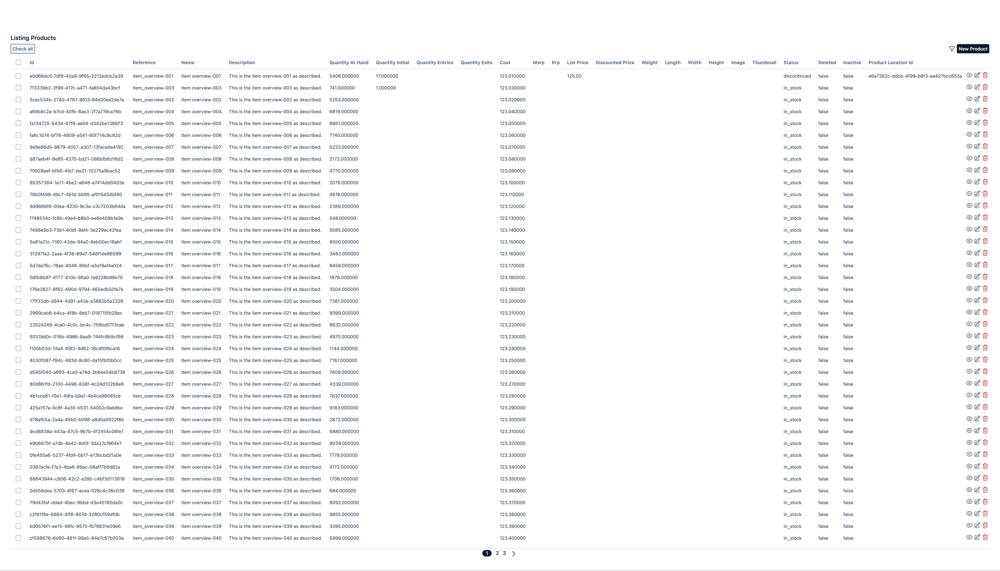
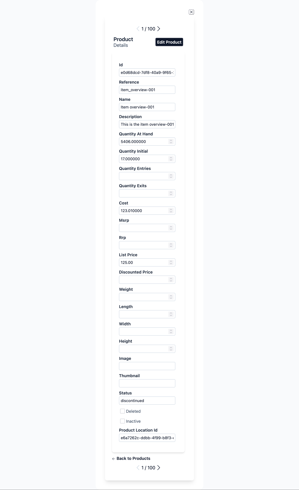
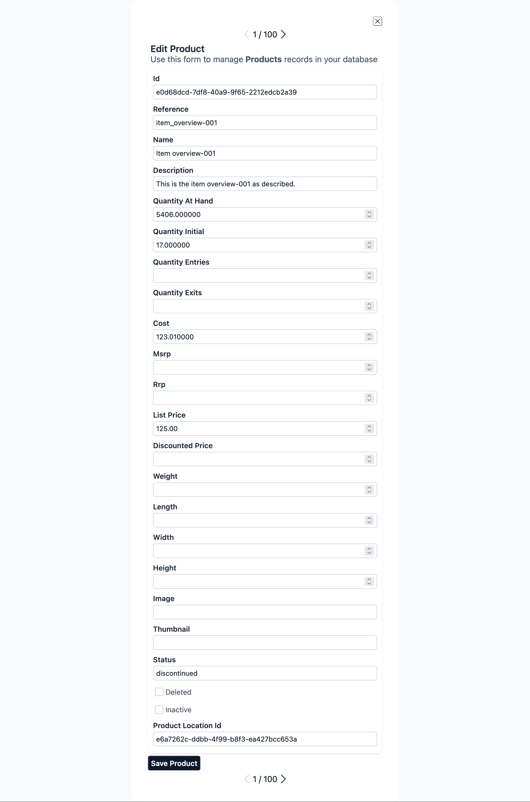
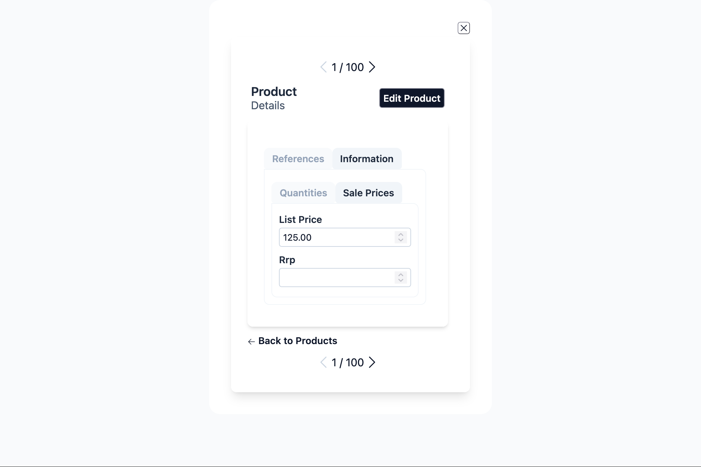
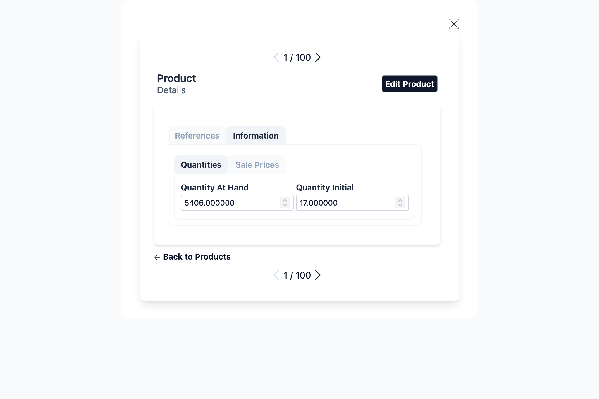

# Layout System

Aurora UIX provides a flexible layout DSL for organizing fields in index, form, and show views.

The layout system gives you full control over UI structure. By default, Aurora UIX generates layouts automatically from your resource metadata, so you get a functional interface with no extra code. When you need custom arrangements, use the provided DSL to create anything from simple field groupings to complex, tabbed forms with nested sections—all with concise, readable code.

## Core Concepts

### Layout Types

Each layout type determines how your resource's fields are presented:

- **`index_columns`** — Selects which fields appear in the list (table) view and their order. Takes a list of field names.
- **`edit_layout`** — Controls how fields are arranged when creating or editing a resource. Renders input fields with metadata options like `placeholder` and `required`.
- **`show_layout`** — Specifies read-only detail view layout using the same resource metadata but rendered as static values.

### Sub-Layout Containers

Sub-layouts are organizational containers that structure how fields are displayed. You can nest them freely to achieve complex layouts:

- **`inline(fields)`** — Arranges fields/sub-layouts horizontally in a single row
- **`stacked(fields)`** — Arranges fields/sub-layouts vertically in a column (default when no layout defined)
- **`group(title, fields)`** or **`group(title, do_block)`** — Visually groups related fields under a title with a border/frame
- **`sections(do_block)`** — Creates a tabbed container; use with `section` blocks
- **`section(title, fields)`** or **`section(title, do_block)`** — Represents a single tab; holds fields or nested layouts

### Field Options

Field-level customizations (like `readonly`, `hidden`, `renderer`) defined in your resource metadata are automatically applied wherever the field appears, across all layouts.

## Layout Examples

All examples below use this resource metadata:

```elixir
auix_resource_metadata :product, context: MyApp.Inventory, schema: Product do
  field :reference, required: true
  field :name, required: true
  field :description
  field :price, precision: 12, scale: 2
  field :quantity_initial
  field :quantity_entries
  field :quantity_exits
  field :quantity_at_hand
end
```

### 1. Default Layout (No Configuration)

When you don't define a layout, Aurora UIX automatically generates one from all available fields:

```elixir
auix_create_ui do
  # No layout specified - Aurora generates defaults for index, show, and edit
end
```

Generated layouts:
- **Index**: Shows all fields in table columns
- **Edit/Show**: Displays fields in vertical (stacked) order

<!-- Screenshot captured in test server URL: create-ui-default-layout-products -->
<!-- ../../test/cases_live/create_ui_default_layout_test.exs -->




### 2. Inline Layout — Horizontal Field Arrangement
<!-- Screenshot captured in test server URL: association-many_to_one_selector-layout-product_locations -->
<!-- In edit mode -->
<!-- ../../test/cases_live/association_many2one_selector_ui_layout_test.exs -->
Use `inline` to display fields side-by-side in a row:

```elixir
edit_layout :product_location do
  inline [:reference, :name, :type]
end
```

**Result**: Three fields displayed horizontally in a single row.


### 3. Stacked Layout — Vertical Field Arrangement
<!-- Screenshot captured in test server URL: association-many_to_one_selector-layout-products -->
<!-- In edit mode -->
<!-- ../../test/cases_live/association_many2one_selector_ui_layout_test.exs -->

Use `stacked` to display fields one below another:

```elixir
edit_layout :product do
  stacked([
    :reference,
    :name,
    :description,
    :quantity_initial,
    :product_location_id,
    :product_location
  ])
end
```

**Result**: Fields are displayed vertically in a column.


### 4. Group Layout — Bordered Field Grouping
<!-- Screenshot captured in test server URL: group-ui-layout-products -->
<!-- In edit mode -->
<!-- ../../test/cases_live/group_ui_layout_test.exs -->

Use `group(title)` to visually frame related fields under a title:

```elixir
edit_layout :product do
  group "Product Info" do
    stacked [:reference, :name, :description]
  end
end
```

Alternatively, pass fields directly without a `do` block:

```elixir
edit_layout :product do
  group "Product Info", [:reference, :name, :description]
end
```

**Result**: Fields grouped in a bordered section with a title.


### 5. Sections Layout — Tabbed Interface
<!-- Screenshot captured in test server URL: section-ui-layout-products -->
<!-- In edit mode -->
<!-- ../../test/cases_live/section_ui_layout_test.exs -->

Use `sections` with `section` blocks to create a tabbed interface:

```elixir
  auix_create_ui do
    edit_layout :product, [] do
      inline([:reference, :name, :description])

      # section_index_1
      sections do
        # section_index_1, tab_index_1
        section "Quantities" do
          inline([:quantity_at_hand, :quantity_initial])
        end

        # section_index_1, tab_index_2
        section "Sale Prices" do
          stacked([:list_price, :rrp])
        end
      end
    end
  end
```

**Result**: Multiple tabs; clicking a tab shows only that section's fields.


### 6. Complex Nested Layout
<!-- Screenshot captured in test server URL: nested-sections-ui-layout-products -->
<!-- In edit mode -->
<!-- ../../test/cases_live/nested_sections_ui_layout_test.exs -->

Combine all layout types for sophisticated UIs:

```elixir
  auix_create_ui do
    edit_layout :product, [] do
      # sections_index_1
      sections do
        # sections_index_1 tab_index_1
        section "References" do
          inline([:reference, :name])

          # sections_index_2
          sections do
            # sections_index_2 tab_index_1
            section "Descriptions" do
              inline([:description, :status])
            end

            # sections_index_2 tab_index_2
            section "Specifications" do
              stacked do
                inline([:width, :height, :length])
                inline([:weight])
              end
            end
          end
        end

        # sections_index_1 tab_index_2
        section "Information" do
          # sections_index_3
          sections do
            # sections_index_3 tab_index_1
            section "Quantities" do
              inline([:quantity_at_hand, :quantity_initial])
            end

            # sections_index_3 tab_index_2
            section "Sale Prices", default: true do
              stacked([:list_price, :rrp])
            end
          end
        end
      end
    end
  end

```

**Result**:
- Top section: Reference and name in a bordered group, arranged horizontally
- Middle: Tabbed sections for description and quantities
- Bottom: Price field





## Layout Customization

### Layout Options by Type

Each layout type (`:index`, `:form`, `:show`) supports specific customization options that control titles, subtitles, pagination, and more.

#### Index Layout Options

Controls list view pagination, titles, and row/header actions:

```elixir
index_columns :product, [:reference, :name, :price],
  page_title: "Products",
  page_subtitle: "Manage your inventory",
  pagination_items_per_page: 20,
  pagination_disabled?: false,
  order_by: [{:name, :asc}],
  where: dynamic([p], p.active == true)
```

**Common Options:**
- `:page_title` — Main title (default: `"Listing {title}"`)
- `:page_subtitle` — Subtitle (default: empty)
- `:pagination_items_per_page` — Rows per page (default: 40)
- `:pagination_disabled?` — Disable pagination (default: `false`)
- `:order_by` — Initial sort order; uses `Aurora.Ctx.QueryBuilder` syntax
- `:where` — Query filter; uses `Aurora.Ctx.QueryBuilder` syntax

#### Form Layout Options

Controls edit/new form titles and subtitles:

```elixir
edit_layout :product,
  edit_title: "Edit Product",
  edit_subtitle: "Update product details",
  new_title: "Create New Product",
  new_subtitle: "Add a product to your inventory"
do
  stacked [:reference, :name, :description]
end
```

**Common Options:**
- `:edit_title` — Title for edit form (default: `"Edit {name}"`)
- `:edit_subtitle` — Subtitle for edit form (default: `"Use this form to manage <strong>{title}</strong> records in your database"`)
- `:new_title` — Title for create form (default: `"New {name}"`)
- `:new_subtitle` — Subtitle for create form (default: `"Creates a new <strong>{name}</strong> record in your database"`)

#### Show Layout Options

Controls detail view titles and subtitles:

```elixir
show_layout :product,
  page_title: "Product Details",
  page_subtitle: "Full product information"
do
  stacked [:reference, :name, :description, :price]
end
```

**Common Options:**
- `:page_title` — Main title (default: `"{name}"` - the resource name)
- `:page_subtitle` — Subtitle (default: `"Details"`)

### Dynamic Titles & Subtitles

For dynamic content, pass function references (named functions only, not anonymous):

```elixir
defmodule MyAppWeb.ProductViews do
  def custom_edit_title(assigns) do
    ~H"Edit #{assigns.auix.name} (ID: #{assigns.entity.id})"
  end

  def custom_page_title(assigns) do
    ~H"Product: #{assigns.entity.name}"
  end

  # Layout definitions
  edit_layout :product, edit_title: &custom_edit_title/1 do
    stacked [:reference, :name, :description]
  end

  show_layout :product, page_title: &custom_page_title/1 do
    stacked [:reference, :name, :price]
  end
end
```

The function receives `assigns` and should return rendered HTML (using sigil `~H`).

### Field-Level Options

Customize individual fields within any layout using keyword options:

```elixir
edit_layout :product do
  inline [
    reference: [readonly: true, length: 20],
    name: [placeholder: "Product name", length: 100],
    id: [hidden: true]
  ]
end
```

**Common Field Options:**
- `:readonly` — Make field read-only
- `:hidden` — Hide field from UI
- `:renderer` — Custom rendering function
- `:length` — Input field character width
- `:placeholder` — Placeholder text
- `:option_label` — For select/radio fields

For complete field option reference, see the `Aurora.Uix.Layout.Blueprint` module documentation.

## Actions: Customizing Buttons & Links

Aurora UIX layouts support action customization for index, form, and show views. Actions control buttons and links in the UI (row actions for table rows, header actions for page-level buttons).

### Action Types

**Row Actions** (index layouts only):
- Default row actions: `:default_row_edit`, `:default_row_delete`
- Can be added, replaced, or removed

**Header Actions**:
- Default header actions: `:default_new`, `:default_export`
- Can be added, replaced, or removed

### Action Options

All action options accept `{action_name, &function/1}` pairs where the function receives assigns:

```elixir
# Add a custom action at the end
add_row_action: {:custom_archive, &MyViews.archive_action/1}

# Insert a custom action at a specific position
insert_row_action: {:custom_approve, &MyViews.approve_action/1}

# Replace an existing action
replace_row_action: {:default_row_edit, &MyViews.custom_edit_action/1}

# Remove an action by name
remove_row_action: :default_row_delete
```

### Example: Custom Row & Header Actions

```elixir
defmodule MyAppWeb.ProductViews do
  # Custom action for archive row
  def archive_action(assigns) do
    {id, product} = assigns.auix.row_info
    ~H"""
    <button phx-click="archive" phx-value-id={id} class="btn btn-sm btn-warning">
      Archive
    </button>
    """
  end

  # Custom action for export header
  def export_action(assigns) do
    ~H"""
    <button phx-click="export-all" class="btn btn-sm btn-info">
      Export CSV
    </button>
    """
  end

  # Layout with custom actions
  index_columns :product, [:reference, :name, :price],
    add_row_action: {:custom_archive, &archive_action/1},
    remove_row_action: :default_row_delete,
    add_header_action: {:export, &export_action/1}

  edit_layout :product do
    stacked [:reference, :name, :description]
  end

  show_layout :product do
    stacked [:reference, :name, :price]
  end
end
```

### Important Notes

- **Row action receives** `@auix.row_info` — a tuple `{id, entity}` for the current row
- **Header action receives** standard assigns; access resource via `assigns.entity`
- **Named functions only** — anonymous functions are not supported
- **Use in all layout types** — index, form, and show layouts support actions

For advanced action customization, see `Aurora.Uix.Templates.Basic.Actions` module documentation.
## Advanced Patterns

### Nesting Fields and Blocks

Layouts can accept either a list of fields or a `do` block containing nested layouts:

```elixir
# Direct field list
inline [:reference, :name]

# Nested block with sub-layouts
inline do
  group "Section 1", [:reference, :name]
  group "Section 2", [:description]
end

# Mixed: both fields and nested blocks are allowed
stacked do
  inline [:reference, :name]
  group "Details" do
    stacked [:description, :price]
  end
end
```

### QueryBuilder for Advanced Filtering

For complex filtering and sorting in index layouts, use `Aurora.Ctx.QueryBuilder` syntax:

```elixir
import Aurora.Ctx.QueryBuilder

index_columns :product, [:reference, :name, :price],
  where: dynamic([p], p.active == true and p.stock > 0),
  order_by: [
    {:name, :asc},
    {:created_at, :desc}
  ]
```

This enables:
- Dynamic query predicates with Ecto's dynamic
- Multi-field sorting
- Complex business logic filters

### Conditional Field Visibility

Use field options to hide fields conditionally:

```elixir
edit_layout :product do
  stacked [
    id: [hidden: true],          # Always hidden
    reference: [readonly: true], # Visible but read-only
    name: []                      # Normal editable field
  ]
end
```

## Best Practices

1. **Keep layouts readable** — Avoid deeply nested structures; prefer multiple groups over excessive nesting
2. **Use meaningful group titles** — Titles help users understand field organization
3. **Group related fields** — Use `group` or `sections` to organize logically related fields
4. **Test responsiveness** — Layouts adjust for mobile/tablet; test on multiple screen sizes
5. **Leverage sections for long forms** — Use tabs to avoid overwhelming users with too many fields at once
6. **Keep field order consistent** — Match order between index, edit, and show layouts when possible
7. **Use field options judiciously** — Overriding too many field options makes maintenance harder; prefer metadata-level configuration

## Next Steps

- Review [Resource Metadata](./resource_metadata.md) for field configuration options
- Explore [LiveView Integration](./liveview.md) to handle custom events in your layouts
- Check the [Troubleshooting Guide](../advanced/troubleshooting.md) for common layout issues
