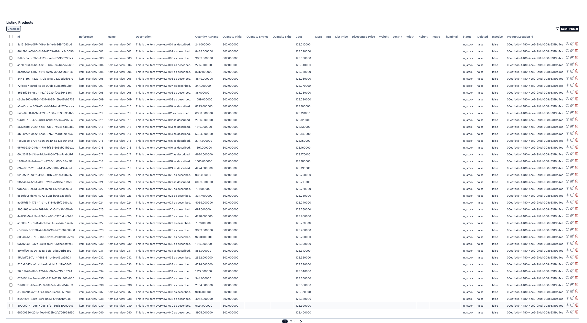
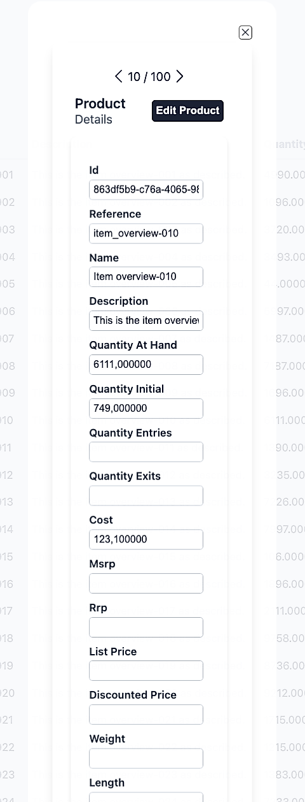
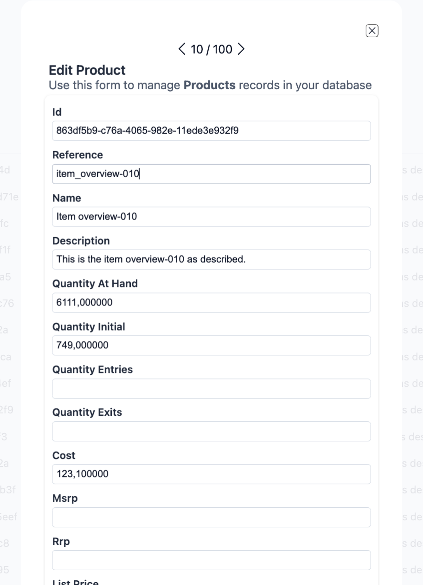
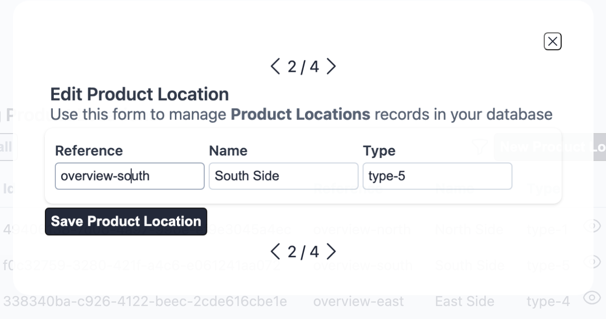
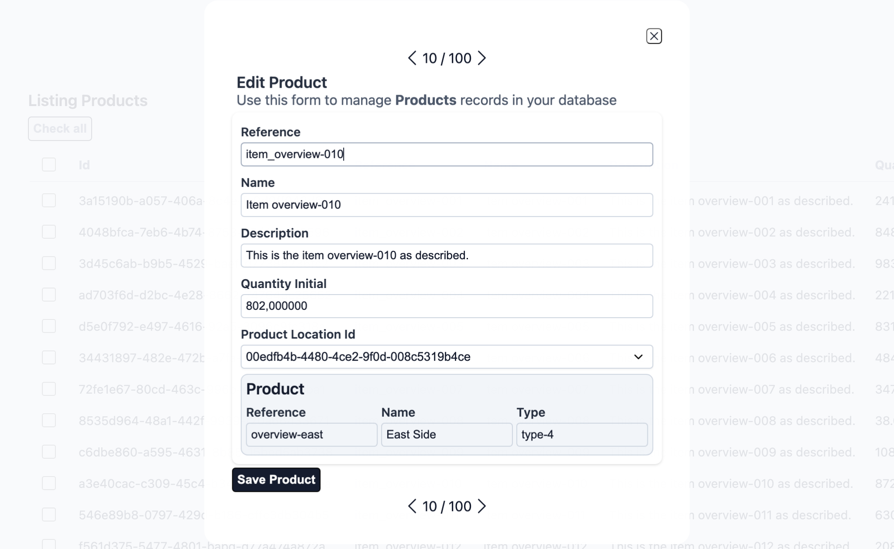
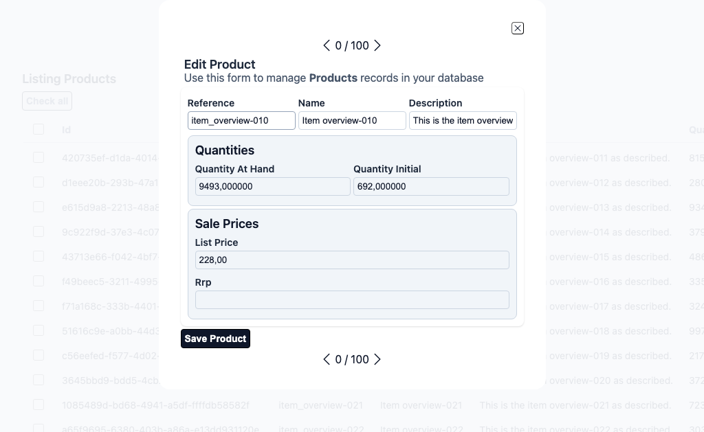
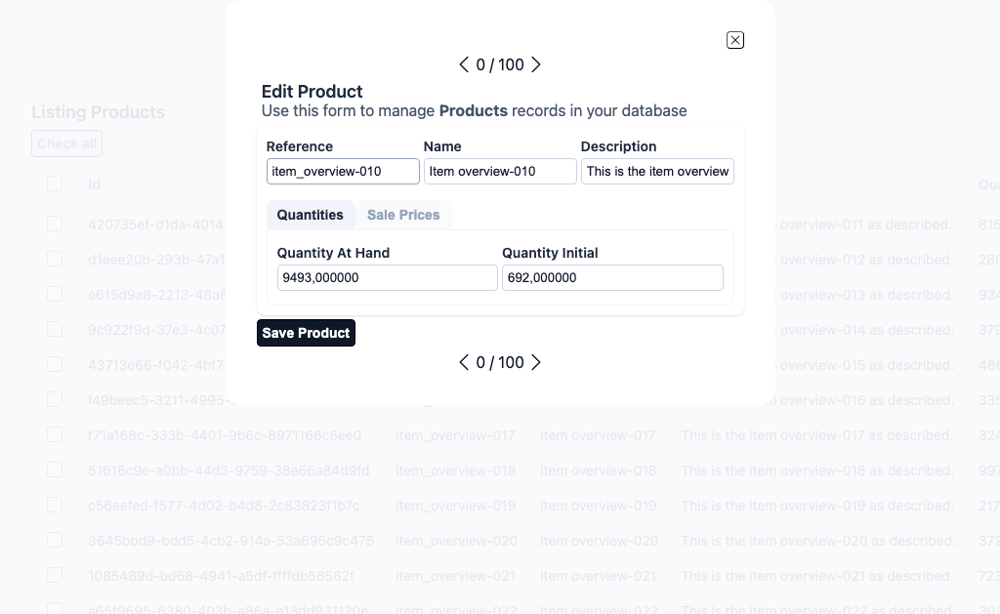
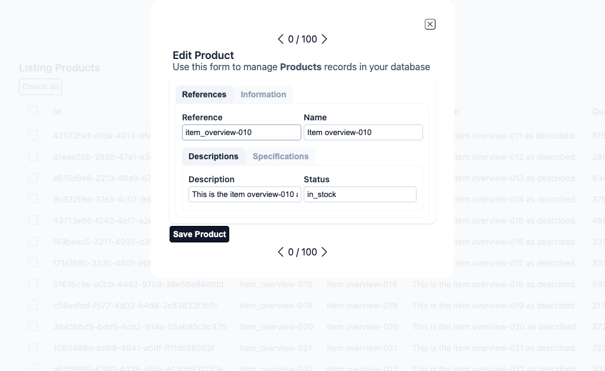
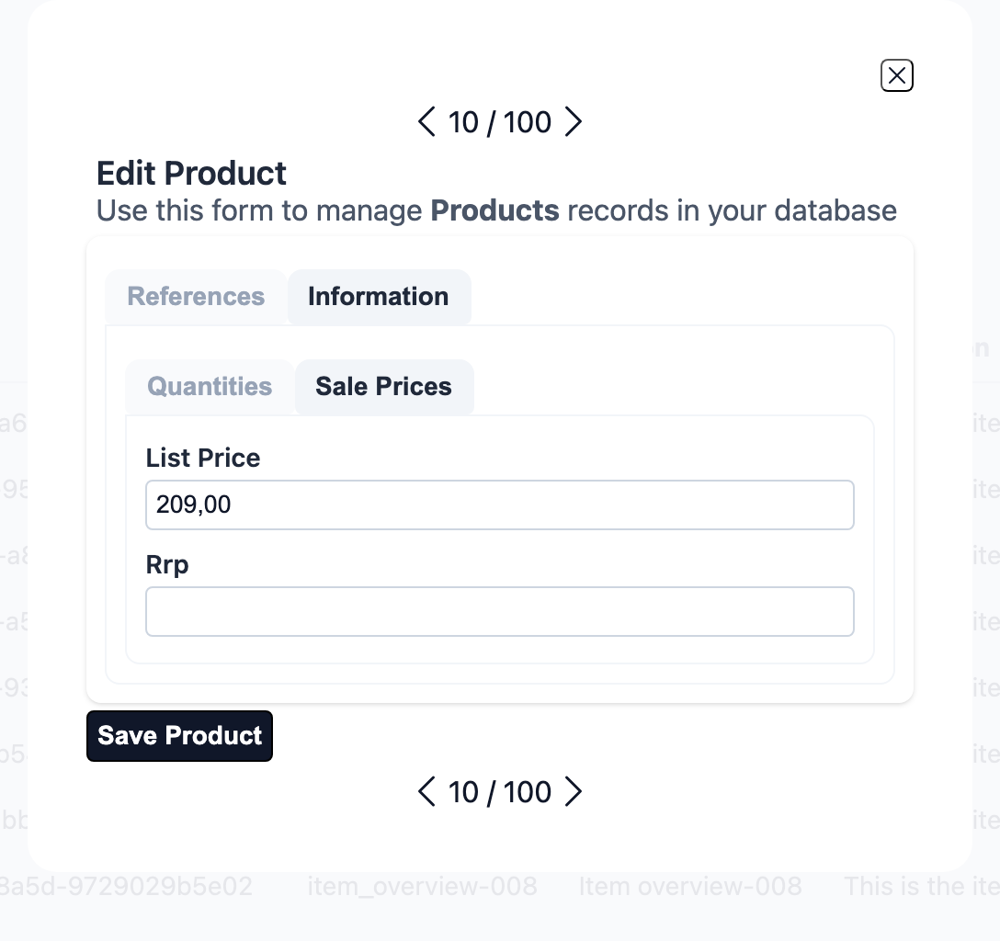
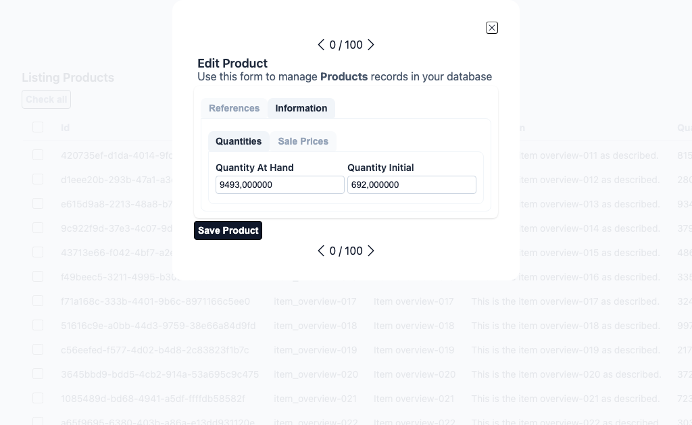

# Layout System

Aurora UIX provides a flexible layout DSL for organizing fields in index, form, and show views.

The layout system gives you full control over UI structure. By default, Aurora UIX generates layouts automatically from your resource metadata, so you get a functional interface with no extra code. When you need custom arrangements, use the provided DSL to create anything from simple field groupings to complex, tabbed forms with nested sections—all with concise, readable code.

## Core Concepts

### Layout Types

Each layout type determines how your resource's fields are presented:

- **`index_columns`** — Selects which fields appear in the list (table) view and their order. Takes a list of field names.
- **`edit_layout`** — Controls how fields are arranged when creating or editing a resource. Renders input fields with metadata options like `placeholder` and `required`.
- **`show_layout`** — Specifies read-only detail view layout using the same resource metadata but rendered as static values.

### Sub-Layout Containers

Sub-layouts are organizational containers that structure how fields are displayed. You can nest them freely to achieve complex layouts:

- **`inline(fields)`** — Arranges fields/sub-layouts horizontally in a single row
- **`stacked(fields)`** — Arranges fields/sub-layouts vertically in a column (default when no layout defined)
- **`group(title, fields)`** or **`group(title, do_block)`** — Visually groups related fields under a title with a border/frame
- **`sections(do_block)`** — Creates a tabbed container; use with `section` blocks
- **`section(title, fields)`** or **`section(title, do_block)`** — Represents a single tab; holds fields or nested layouts

### Field Options

Field-level customizations (like `readonly`, `hidden`, `renderer`) defined in your resource metadata are automatically applied wherever the field appears, across all layouts.

## Layout Examples

All examples below use this resource metadata:

```elixir
auix_resource_metadata :product, context: MyApp.Inventory, schema: Product do
  field :reference, required: true
  field :name, required: true
  field :description
  field :price, precision: 12, scale: 2
  field :quantity_initial
  field :quantity_entries
  field :quantity_exits
  field :quantity_at_hand
end
```

### 1. Default Layout (No Configuration)

When you don't define a layout, Aurora UIX automatically generates one from all available fields:

```elixir
auix_create_ui do
  # No layout specified - Aurora generates defaults for index, show, and edit
end
```

Generated layouts:
- **Index**: Shows all fields in table columns

<!-- Screenshot captured in test server URL: create-ui-default-layout-products -->
<!-- ../../test/cases_live/create_ui_default_layout_test.exs -->
<div align="center">
    
</div>

- **Show / Edit**: Displays fields in vertical (stacked) order

<div align="center">
    
</div>

---

<div align="center">
    
</div>

### 2. Inline Layout — Horizontal Field Arrangement
<!-- Screenshot captured in test server URL: association-many_to_one_selector-layout-product_locations -->
<!-- In edit mode -->
<!-- ../../test/cases_live/association_many2one_selector_ui_layout_test.exs -->
Use `inline` to display fields side-by-side in a row:

```elixir
edit_layout :product_location do
  inline [:reference, :name, :type]
end
```

**Result**: Three fields displayed horizontally in a single row.

<div align="center">
    
</div>

### 3. Stacked Layout — Vertical Field Arrangement
<!-- Screenshot captured in test server URL: association-many_to_one_selector-layout-products -->
<!-- In edit mode -->
<!-- ../../test/cases_live/association_many2one_selector_ui_layout_test.exs -->

Use `stacked` to display fields one below another:

```elixir
edit_layout :product do
  stacked([
    :reference,
    :name,
    :description,
    :quantity_initial,
    :product_location_id,
    :product_location
  ])
end
```

**Result**: Fields are displayed vertically in a column.

<div align="center">
    
</div>

### 4. Group Layout — Bordered Field Grouping
<!-- Screenshot captured in test server URL: group-ui-layout-products -->
<!-- In edit mode -->
<!-- ../../test/cases_live/group_ui_layout_test.exs -->

Use `group(title)` to visually frame related fields under a title:

```elixir
edit_layout :product do
  group "Product Info" do
    stacked [:reference, :name, :description]
  end
end
```

Alternatively, pass fields directly without a `do` block:

```elixir
edit_layout :product do
  group "Product Info", [:reference, :name, :description]
end
```
For example:

```elixir
edit_layout :product, [] do
  inline([:reference, :name, :description])

  group "Quantities" do
    inline([:quantity_at_hand, :quantity_initial])
  end

  group "Sale Prices" do
    stacked([:list_price, :rrp])
  end
end

```
**Result**: Fields grouped in a bordered section with a title.

<div align="center">
    
</div>

### 5. Sections Layout — Tabbed Interface
<!-- Screenshot captured in test server URL: section-ui-layout-products -->
<!-- In edit mode -->
<!-- ../../test/cases_live/section_ui_layout_test.exs -->

Use `sections` with `section` blocks to create a tabbed interface:

```elixir
  auix_create_ui do
    edit_layout :product, [] do
      inline([:reference, :name, :description])

      # section_index_1
      sections do
        # section_index_1, tab_index_1
        section "Quantities" do
          inline([:quantity_at_hand, :quantity_initial])
        end

        # section_index_1, tab_index_2
        section "Sale Prices" do
          stacked([:list_price, :rrp])
        end
      end
    end
  end
```

**Result**: Multiple tabs; clicking a tab shows only that section's fields.

<div align="center">
    
</div>

---

<div align="center">
    
</div>

### 6. Complex Nested Layout
<!-- Screenshot captured in test server URL: nested-sections-ui-layout-products -->
<!-- In edit mode -->
<!-- ../../test/cases_live/nested_sections_ui_layout_test.exs -->

Combine all layout types for sophisticated UIs:

```elixir
  auix_create_ui do
    edit_layout :product, [] do
      # sections_index_1
      sections do
        # sections_index_1 tab_index_1
        section "References" do
          inline([:reference, :name])

          # sections_index_2
          sections do
            # sections_index_2 tab_index_1
            section "Descriptions" do
              inline([:description, :status])
            end

            # sections_index_2 tab_index_2
            section "Specifications" do
              stacked do
                inline([:width, :height, :length])
                inline([:weight])
              end
            end
          end
        end

        # sections_index_1 tab_index_2
        section "Information" do
          # sections_index_3
          sections do
            # sections_index_3 tab_index_1
            section "Quantities" do
              inline([:quantity_at_hand, :quantity_initial])
            end

            # sections_index_3 tab_index_2
            section "Sale Prices", default: true do
              stacked([:list_price, :rrp])
            end
          end
        end
      end
    end
  end

```

**Result**:
- Top section: Reference and name in the same row
- Middle: Nested section inside the first tab containing description and quantities
- Information tab: Nested section inside the information top level tab containing price related fields 

<div align="center">
    
</div>

---

<div align="center">
    
</div>

---

<div align="center">
    
</div>
## Layout Customization

### Layout Options by Type

Each layout type (`:index`, `:form`, `:show`) supports specific customization options that control titles, subtitles, pagination, and more.

#### Index Layout Options

Controls list view pagination, titles, and row/header actions:

```elixir
index_columns :product, [:reference, :name, :price],
  page_title: "Products",
  page_subtitle: "Manage your inventory",
  pagination_items_per_page: 20,
  pagination_disabled?: false,
  order_by: [{:name, :asc}],
  where: dynamic([p], p.active == true)
```

**Options:**
- `:page_title` — Main title (default: `"Listing {title}"`)
- `:page_subtitle` — Subtitle (default: empty)
- `:pagination_items_per_page` — Rows per page (default: 40)
- `:pagination_disabled?` — Disable pagination (default: `false`)
- `:order_by` — Initial sort order; uses `Aurora.Ctx.QueryBuilder` syntax
- `:where` — Query filter; uses `Aurora.Ctx.QueryBuilder` syntax

#### Form Layout Options

Controls edit/new form titles and subtitles:

```elixir
edit_layout :product,
  edit_title: "Edit Product",
  edit_subtitle: "Update product details",
  new_title: "Create New Product",
  new_subtitle: "Add a product to your inventory"
do
  stacked [:reference, :name, :description]
end
```

**Options:**
- `:edit_title` — Title for edit form (default: `"Edit {name}"`)
- `:edit_subtitle` — Subtitle for edit form (default: `"Use this form to manage <strong>{title}</strong> records in your database"`)
- `:new_title` — Title for create form (default: `"New {name}"`)
- `:new_subtitle` — Subtitle for create form (default: `"Creates a new <strong>{name}</strong> record in your database"`)

#### Show Layout Options

Controls detail view titles and subtitles:

```elixir
show_layout :product,
  page_title: "Product Details",
  page_subtitle: "Full product information"
do
  stacked [:reference, :name, :description, :price]
end
```

**Options:**
- `:page_title` — Main title (default: `"{name}"` - the resource name)
- `:page_subtitle` — Subtitle (default: `"Details"`)

### Dynamic Titles & Subtitles

For dynamic content, pass function references (named functions only, not anonymous):

```elixir
defmodule MyAppWeb.ProductViews do
  def custom_edit_title(assigns) do
    ~H"Edit #{assigns.auix.name} (ID: #{assigns.entity.id})"
  end

  def custom_page_title(assigns) do
    ~H"Product: #{assigns.entity.name}"
  end

  # Layout definitions
  edit_layout :product, edit_title: &custom_edit_title/1 do
    stacked [:reference, :name, :description]
  end

  show_layout :product, page_title: &custom_page_title/1 do
    stacked [:reference, :name, :price]
  end
end
```

The function receives `assigns` and should return rendered HTML (using sigil `~H`).

### Field-Level Options

Customize individual fields within any layout using keyword options:

```elixir
edit_layout :product do
  inline [
    reference: [readonly: true, length: 20],
    name: [placeholder: "Product name", length: 100],
    id: [hidden: true]
  ]
end
```

**Relevant Field Options:**
- `:readonly` — Make field read-only
- `:hidden` — Hide field from UI
- `:renderer` — Custom rendering function
- `:length` — Input field character width
- `:placeholder` — Placeholder text
- `:option_label` — For select/radio fields

For complete field attributes reference, see the `Aurora.Uix.Field` module documentation.

## Actions: Customizing Buttons & Links

Aurora UIX provides a comprehensive action system for customizing buttons and links across all layout types. Actions are function components that receive assigns and return rendered HTML.

### Understanding Actions

Actions are defined as `Aurora.Uix.Action` structs with:
- `:name` — unique identifier (atom or binary)
- `:function_component` — a function that receives assigns and returns rendered output

Actions are organized into **action groups** specific to each layout type. Each group represents a location where actions are rendered (headers, footers, rows, etc.).

### Action Groups by Layout Type

**Index Layout:**
- `:index_row_actions` — Actions for each table row (show, edit, delete)
- `:index_selected_actions` — Actions when items are selected (uncheck all, delete all, check all)
- `:index_selected_all_actions` — Toggle selection of all rows in current page
- `:index_header_actions` — Actions in the page header (toggle filters, clear filters, submit filters, new)
- `:index_footer_actions` — Actions in the page footer (pagination)
- `:index_filters_actions` — Actions in the filters section

**Form Layout:**
- `:form_header_actions` — Actions in the form header (typically empty by default)
- `:form_footer_actions` — Actions in the form footer (save button)

**Show Layout:**
- `:show_header_actions` — Actions in the show page header (edit button)
- `:show_footer_actions` — Actions in the show page footer (back link)

**One-to-Many & Embeds-Many Layouts:**
- `:one_to_many_header_actions` / `:embeds_many_header_actions`
- `:one_to_many_footer_actions` / `:embeds_many_footer_actions`
- `:one_to_many_row_actions` / `:embeds_many_row_actions`
- `:embeds_many_new_entry_actions`
- `:embeds_many_existing_actions`

### Action Operations

Aurora UIX provides four operations to customize actions in layout options:

**Add Action** — Appends action to the end of the group:
```elixir
add_row_action: {:archive, &MyViews.archive_action/1}
```

**Insert Action** — Prepends action to the beginning of the group:
```elixir
insert_row_action: {:approve, &MyViews.approve_action/1}
```

**Replace Action** — Replaces an existing action by name:
```elixir
replace_row_action: {:default_row_edit, &MyViews.custom_edit_action/1}
```

**Remove Action** — Removes an action by name:
```elixir
remove_row_action: :default_row_delete
```

All operations accept `{action_name, &function/1}` pairs (except remove, which only needs the name).

### Default Actions Reference

**Index Layout Defaults:**
- `:default_row_show` — Show icon link in row actions
- `:default_row_edit` — Edit icon link in row actions
- `:default_row_delete` — Delete icon link with confirmation in row actions
- `:default_toggle_all_selected` — Checkbox to select all rows in current page
- `:default_selected_uncheck_all` — Button to uncheck all selected items
- `:default_selected_delete_all` — Button to delete all selected items (with confirmation)
- `:default_selected_check_all` — Button to check all items
- `:default_toggle_filters` — Icon to open/close filters panel
- `:default_clear` — Clear filters button
- `:default_submit` — Submit filters button
- `:default_new` — New entity button in header
- `:default_pagination` — Pagination controls with responsive breakpoints

**Form Layout Defaults:**
- `:default_save` — Save button in footer

**Show Layout Defaults:**
- `:default_edit` — Edit button in header
- `:default_back` — Back link in footer

### Example: Customizing Index Actions

```elixir
defmodule MyAppWeb.ProductViews do
  use Aurora.Uix.View

  # Custom archive action for table rows
  def archive_action(assigns) do
    ~H"""
    <.link
      phx-click={JS.push("archive", value: %{id: row_info_id(@auix)})}
      name={"auix-archive-#{@auix.module}"}
      data-confirm="Archive this product?"
    >
      <.icon class="auix-icon-size-5 auix-icon-warning" name="hero-archive-box" />
    </.link>
    """
  end

  # Custom export action for header
  def export_action(assigns) do
    ~H"""
    <.button phx-click="export-all" name={"auix-export-#{@auix.module}"}>
      <.icon name="hero-arrow-down-tray" class="auix-icon-size-4" />
      Export CSV
    </.button>
    """
  end

  # Custom edit with different styling
  def custom_edit_action(assigns) do
    ~H"""
    <.auix_link 
      class="auix-index-row-action auix-custom-edit"
      patch={"/#{@auix.uri_path}/#{row_info_id(@auix)}/edit"}
      name={"auix-edit-#{@auix.module}"}
    >
      <.icon class="auix-icon-size-5 auix-icon-primary" name="hero-pencil" />
    </.auix_link>
    """
  end

  index_columns :product, [:reference, :name, :price, :stock],
    # Add custom actions
    add_row_action: {:archive, &archive_action/1},
    add_header_action: {:export, &export_action/1},
    # Replace default actions
    replace_row_action: {:default_row_edit, &custom_edit_action/1},
    # Remove unwanted actions
    remove_row_action: :default_row_show

  # Helper to extract row ID from auix context
  defp row_info_id(%{row_info: {_index, row_entity}, primary_key: primary_key}) do
    Aurora.Uix.Templates.Basic.Helpers.primary_key_value(row_entity, primary_key)
  end
end
```

### Example: Customizing Form Actions

```elixir
defmodule MyAppWeb.ProductViews do
  use Aurora.Uix.View

  def save_and_continue_action(assigns) do
    ~H"""
    <.button 
      phx-click="save-continue" 
      phx-disable-with="Saving..." 
      name={"auix-save-continue-#{@auix.module}"}
    >
      Save and Continue
    </.button>
    """
  end

  def cancel_action(assigns) do
    ~H"""
    <.auix_back class="auix-button auix-button--secondary">
      Cancel
    </.auix_back>
    """
  end

  edit_layout :product,
    add_footer_action: {:save_continue, &save_and_continue_action/1},
    add_footer_action: {:cancel, &cancel_action/1}
  do
    stacked [:reference, :name, :description, :price]
  end
end
```

### Example: Customizing Show Actions

```elixir
defmodule MyAppWeb.ProductViews do
  use Aurora.Uix.View

  def duplicate_action(assigns) do
    ~H"""
    <.auix_link 
      patch={"/#{@auix.uri_path}/new?duplicate_from=#{@auix.entity.id}"}
      name={"auix-duplicate-#{@auix.module}"}
    >
      <.button class="auix-button--secondary">Duplicate Product</.button>
    </.auix_link>
    """
  end

  def print_action(assigns) do
    ~H"""
    <.button phx-click="print" phx-value-id={@auix.entity.id} class="auix-button--alt">
      <.icon name="hero-printer" /> Print
    </.button>
    """
  end

  show_layout :product,
    add_header_action: {:duplicate, &duplicate_action/1},
    add_header_action: {:print, &print_action/1}
  do
    stacked [:reference, :name, :description, :price]
  end
end
```

### Important Implementation Notes

**Action Function Signature:**
- Actions must be functions with arity 1 that accept assigns
- Must return rendered output (use `~H"""..."""` sigil)
- Must be named functions (not anonymous functions)

**Available Assigns in Actions:**
- `@auix` — Contains all Aurora UIX context
  - `.row_info` — Tuple of `{index, entity}` for row actions (see Row Info Structure below)
  - `.entity` — Current entity for form/show actions
  - `.module` — Resource module name
  - `.name` — Resource display name
  - `.primary_key` — Primary key field(s)
  - `.uri_path` — Current URI path for navigation
  - `.selection` — Selection state (index layouts only)
  - `.pagination` — Pagination state (index layouts only)
  - `.filters_enabled?` — Whether filters panel is open

**Row Info Structure:**

The `@auix.row_info` in row actions is a 2-tuple containing:
1. **Index/ID** (first element) — The stream identifier or row ID from Phoenix LiveView streams
2. **Entity** (second element) — The actual entity struct/map for the row

```elixir
# Example row_info tuple structure
row_info = {"products-123", %Product{id: 123, name: "Widget", price: 29.99}}

# Extracting components
{stream_id, entity} = assigns.auix.row_info
# stream_id = "products-123"
# entity = %Product{id: 123, name: "Widget", price: 29.99}

# Common patterns for accessing data:
# 1. Get the primary key value
id = row_info_id(assigns.auix)  # Using helper function

# 2. Access entity fields directly
{_id, product} = assigns.auix.row_info
price = product.price

# 3. Pattern match in function head
def custom_action(%{auix: %{row_info: {_index, entity}}} = assigns) do
  ~H"""
  <button phx-click="process" phx-value-id={entity.id}>
    Process {entity.name}
  </button>
  """
end
```

**Helper for Extracting Primary Keys:**

Aurora UIX provides a helper to safely extract primary key values from row_info:

```elixir
defp row_info_id(%{row_info: {_index, row_entity}, primary_key: primary_key}) do
  Aurora.Uix.Templates.Basic.Helpers.primary_key_value(row_entity, primary_key)
end
```

This helper handles both single and composite primary keys:
- Single key: Returns the value directly (e.g., `123`)
- Composite keys: Returns a list of values (e.g., `[123, 456]`)

**Helper Functions:**
- Use `Aurora.Uix.Templates.Basic.Helpers.primary_key_value/2` to extract entity IDs
- Use `<.auix_link>` component for navigation with routing stack preservation
- Use `<.auix_back>` component for back navigation
- Use `Phoenix.LiveView.JS` for client-side interactions

**Action Styling:**
- Use `auix-*` CSS classes for consistent styling
- Row action icons: `auix-icon-size-5` with context classes (`auix-icon-info`, `auix-icon-safe`, `auix-icon-danger`)
- Buttons: `auix-button`, `auix-button--secondary`, `auix-button--alt`

### Action Modification Under the Hood

Actions are stored in the socket's `assigns.auix` map under their respective action group keys. The modification functions (`add_auix_action`, `insert_auix_action`, `replace_auix_action`, `remove_auix_action`) from `Aurora.Uix.Templates.Basic.Helpers` manipulate these lists during layout setup.

For a complete list of available action groups, call `Aurora.Uix.Action.action_groups()`.
## Advanced Patterns

### Nesting Fields and Blocks

Layouts can accept either a list of fields or a `do` block containing nested layouts:

```elixir
# Direct field list
inline [:reference, :name]

# Nested block with sub-layouts
inline do
  group "Section 1", [:reference, :name]
  group "Section 2", [:description]
end

# Mixed: both fields and nested blocks are allowed
stacked do
  inline [:reference, :name]
  group "Details" do
    stacked [:description, :price]
  end
end
```

### QueryBuilder for Advanced Filtering

Aurora UIX index layouts support advanced filtering and sorting. The `:where` and `:order_by` options are passed to `Aurora.Ctx.QueryBuilder.options/2` for query construction.

**Basic Filtering with Tuples:**

```elixir
index_columns :product, [:reference, :name, :price],
  where: [{:active, true}],
  order_by: [asc: :name, desc: :created_at]
```

**Using Comparison Operators:**

The `:where` option accepts tuples with operators for complex filtering:

```elixir
index_columns :product, [:reference, :name, :price],
  where: [
    {:price, :greater_than, 10},
    {:name, :ilike, "%widget%"}
  ],
  order_by: :name
```

**Supported Comparison Operators:**

- `:greater_than` or `:gt` - Greater than
- `:greater_equal_than` or `:ge` - Greater than or equal
- `:less_than` or `:lt` - Less than
- `:less_equal_than` or `:le` - Less than or equal
- `:equal_to` or `:eq` - Equal to
- `:like` - Pattern matching (SQL LIKE with `%` and `_`)
- `:ilike` - Case-insensitive pattern matching
- `:between` - Range query (requires start and end values)

**Range Filtering with Between:**

```elixir
index_columns :product, [:reference, :name, :price],
  where: [{:reference, :between, "A", "M"}],
  order_by: :reference
```

**Multiple Sort Fields:**

```elixir
index_columns :product, [:reference, :name, :price],
  order_by: [asc: :category, desc: :price, asc: :name]
```

This enables:
- Complex filtering with comparison operators
- Multi-field sorting with customizable directions
- Pattern matching with LIKE/ILIKE operators
- Range queries with BETWEEN operator

### Conditional Field Visibility

Use field options to hide fields conditionally:

```elixir
edit_layout :product do
  stacked [
    id: [hidden: true],          # Always hidden
    reference: [readonly: true], # Visible but read-only
    name: []                      # Normal editable field
  ]
end
```

## Best Practices

1. **Keep layouts readable** — Avoid deeply nested structures; prefer multiple groups over excessive nesting
2. **Use meaningful group titles** — Titles help users understand field organization
3. **Group related fields** — Use `group` or `sections` to organize logically related fields
4. **Test responsiveness** — Layouts adjust for mobile/tablet; test on multiple screen sizes
5. **Leverage sections for long forms** — Use tabs to avoid overwhelming users with too many fields at once
6. **Keep field order consistent** — Match order between index, edit, and show layouts when possible
7. **Use field options judiciously** — Overriding too many field options makes maintenance harder; prefer metadata-level configuration

## Next Steps

- Review [Resource Metadata](./resource_metadata.md) for field configuration options
- Explore [LiveView Integration](./liveview.md) to handle custom events in your layouts
- Check the [Troubleshooting Guide](../advanced/troubleshooting.md) for common layout issues
