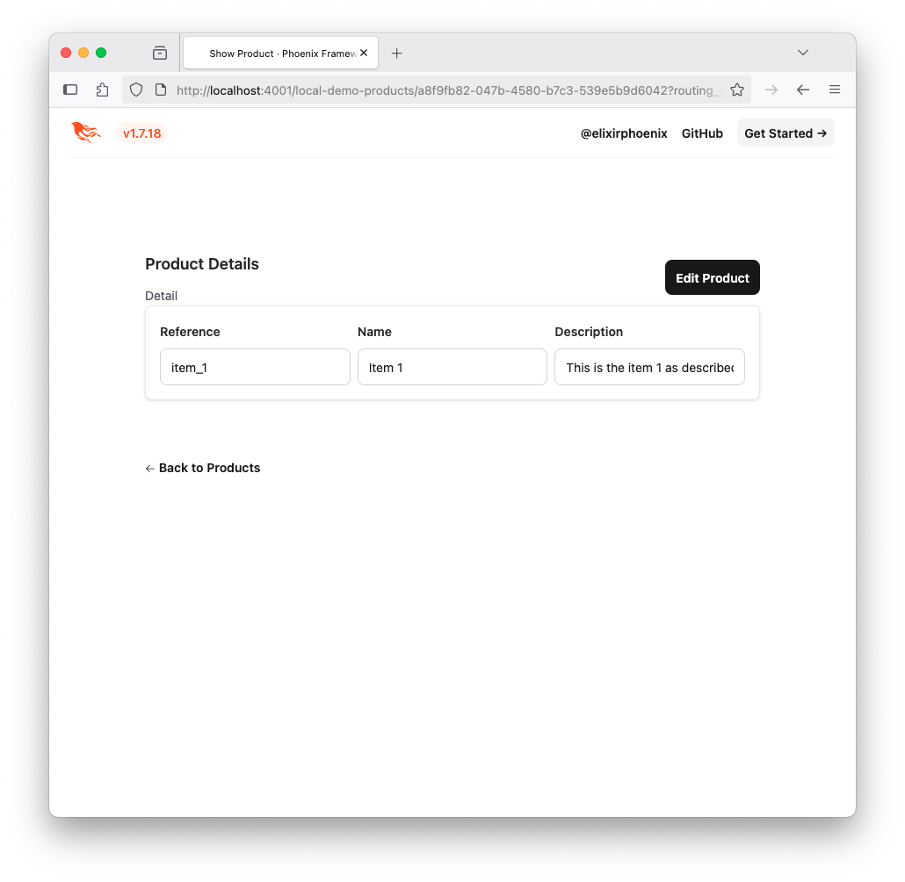
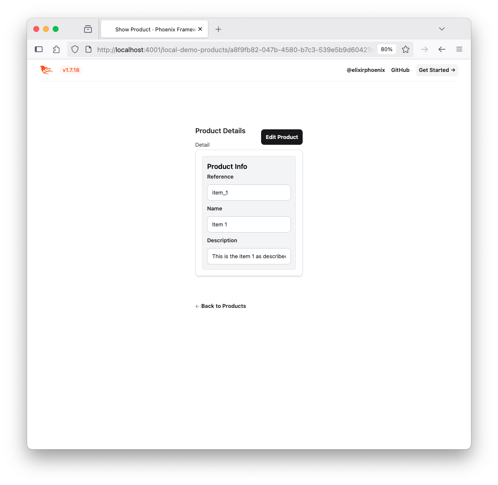
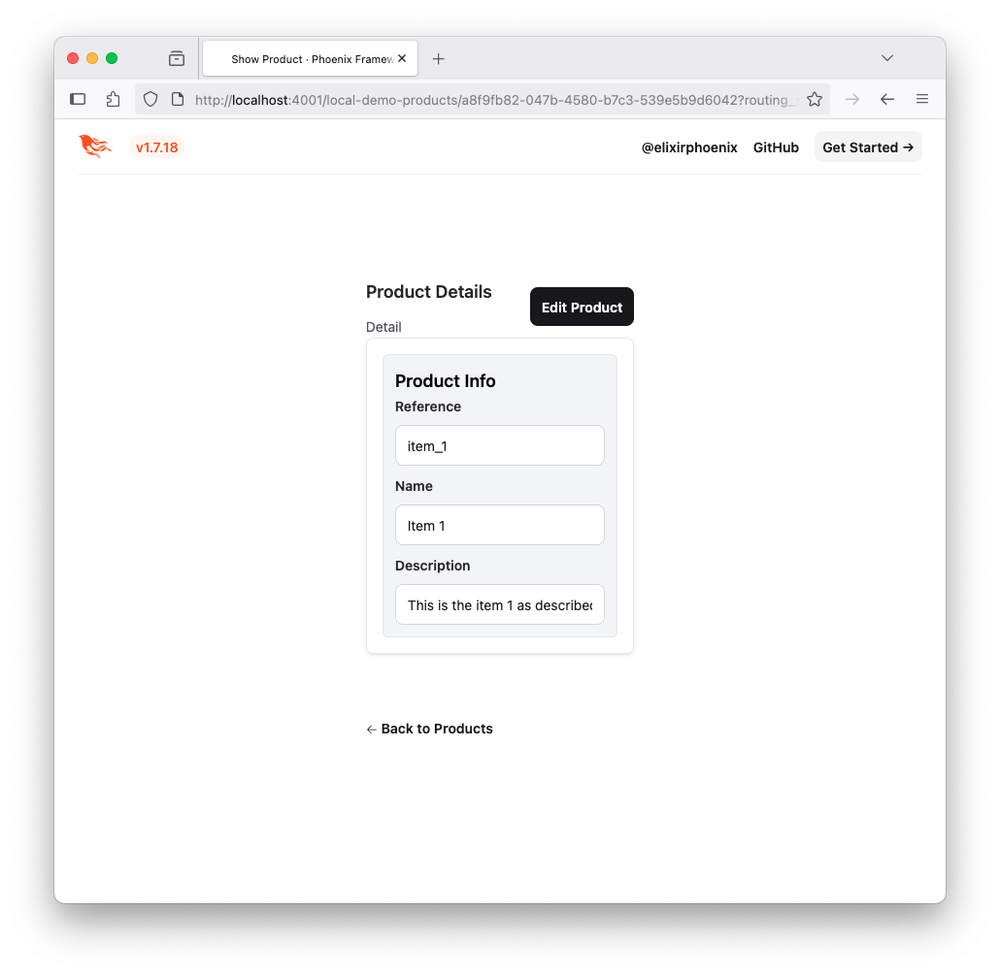

# Layout System

Aurora UIX provides a flexible layout DSL for forms, lists, and detail views.

The layout system is designed to give you full control over how your UI is structured. By default, Aurora UIX generates layouts automatically, so you get a functional interface with no extra code. When you need more control, you can define layouts explicitly using the provided DSL. This allows you to create anything from simple arrangements to complex, visually organized forms and views, all with concise and readable code.

## Layout Types and Their Purpose

Each layout type in Aurora UIX determines how your resource metadata (the fields and associations you describe) is presented in the UI:

- **Index Layout**: Defines which fields from your resource metadata are shown in the list (table) view. You use `index_columns` to select and order fields for the index page.
- **Form Layout**: Controls the arrangement of fields when creating or editing a resource. The form layout uses your resource metadata to generate input fields, respecting options like `placeholder`, `required`, and custom renderers.
- **Show Layout**: Specifies how fields are displayed in the read-only detail view. It uses the same resource metadata, but renders fields as static values.

## Sub-Layouts: Containers for Structure

Sub-layouts are general-purpose containers that let you organize fields and other sub-layouts. This means you can nest fields and other sub-layouts as needed to achieve your desired UI structure.

The main sub-layouts are:

- **inline**: Arranges its contents horizontally in a row.
- **stacked**: Arranges its contents vertically in a column. This is the default sub-layout when no layout is defined.
- **group**: Visually groups related contents under a title and a frame.
- **sections**: Creates a tabbed container. Each `sections` block contains one or more `section` sub-layouts.
- **section**: Represents a single tab inside a `sections` container. Each `section` is itself a container that holds sub-layouts.

Each layout and sub-layout references your resource metadata, so any field-level options (like `readonly`, `renderer`, or `option_label`) are respected wherever the field appears.

## Layout Examples

### 1. No-Code: Default Layout

If you do not define any layout, Aurora UIX generates a default layout for index, show, and edit views based on your resource metadata:

```elixir
auix_create_ui do
  # No layout specified
end
```


### 2. Inline Layout

```elixir
edit_layout :product do
  inline [:reference, :name, :description]
end
```


### 3. Stacked Layout

```elixir
edit_layout :product do
  stacked [:reference, :name, :description]
end
```


### 4. Group Layout

```elixir
edit_layout :product do
  group "Product Info", do: stacked [:reference, :name, :description]
end
```


### 5. Sections Layout

```elixir
edit_layout :product do
  sections do
    section "Main" do
      inline [:reference, :name]
    end
    section "Details" do
      stacked [:description]
    end
  end
end
```


### 6. Nested Layout (Combining All Sub-Layouts)

```elixir
edit_layout :product do
  stacked do
    group "Identification" do
      inline [:reference, :name]
    end
    sections do
      section "Description" do
        stacked [:description]
      end
      section "Quantities" do
        stacked [:quantity_initial, :quantity_entries, :quantity_exits]
      end
    end
    inline [:product_transactions]
  end
end
```


## Default Layouts

If you omit a layout, Aurora UIX generates a default layout for index, show and edit.

## Titles and Subtitles in Layouts

Aurora UIX layouts support customizable titles and subtitles for each view (index, form, show) via layout options. These options let you control the text shown at the top of each page or section, and can be static strings or dynamic functions.

### Supported Options

- **Index and Show Layouts** (see also `Aurora.Uix.Layout.Options.Page`):
  - `:page_title` – The main title for the page (e.g., "Product Details" or "Listing Products").
    - Accepts a string or a function reference of arity 1 (receives assigns).
    - Defaults:
      - Show: `"{name}"` (resource name)
      - Index: `"Listing {title}"` (resource title)
  - `:page_subtitle` – The subtitle for the page (e.g., "Details").
    - Accepts a string or a function reference of arity 1.
    - Defaults:
      - Show: `"Details"`
      - Index: *(none by default)*

- **Form Layouts** (see also `Aurora.Uix.Layout.Options.Form`):
  - `:edit_title` – Title for the edit form.
    - Accepts a string or a function reference of arity 1.
    - Default: `"Edit {name}"`
  - `:edit_subtitle` – Subtitle for the edit form.
    - Accepts a string or a function reference of arity 1.
    - Default: `"Use this form to manage <strong>{title}</strong> records in your database"`
  - `:new_title` – Title for the new resource form (when in index context).
    - Accepts a string or a function reference of arity 1.
    - Default: `"New {name}"`
  - `:new_subtitle` – Subtitle for the new resource form (when in index context).
    - Accepts a string or a function reference of arity 1.
    - Default: `"Creates a new <strong>{name}</strong> record in your database"`

### How to Use

You can set these options directly in your layout macros. For dynamic content, pass a function reference (only named functions are supported, not anonymous functions):

```elixir
defmodule MyView do
  def custom_subtitle(assigns), do: ~H"Custom subtitle for #{assigns.auix.name}"
  def custom_page_title(assigns), do: ~H"Custom page title for #{assigns.auix.name}"
  def custom_action(assigns), do: ~H"<span>Custom</span>"
end

edit_layout :product, edit_title: "Edit Product", edit_subtitle: &MyView.custom_subtitle/1 do
  stacked [:reference, :name, :description]
end

show_layout :product, page_title: "Product Details", page_subtitle: "All about this product" do
  stacked [:reference, :name, :description]
end

index_columns :product, [:reference, :name, :description],
  page_title: &MyView.custom_page_title/1,
  add_row_action: {:custom, &MyView.custom_action/1},
  remove_row_action: :default_row_edit
```

If you do not specify a title or subtitle, Aurora UIX will use the defaults described above. You can also use function references for dynamic content, receiving the assigns map as an argument.

For more details, see the documentation for `Aurora.Uix.Layout.Options.Page`, `Aurora.Uix.Layout.Options.Form`, and `Aurora.Uix.Web.Templates.Basic.Actions.Index`.