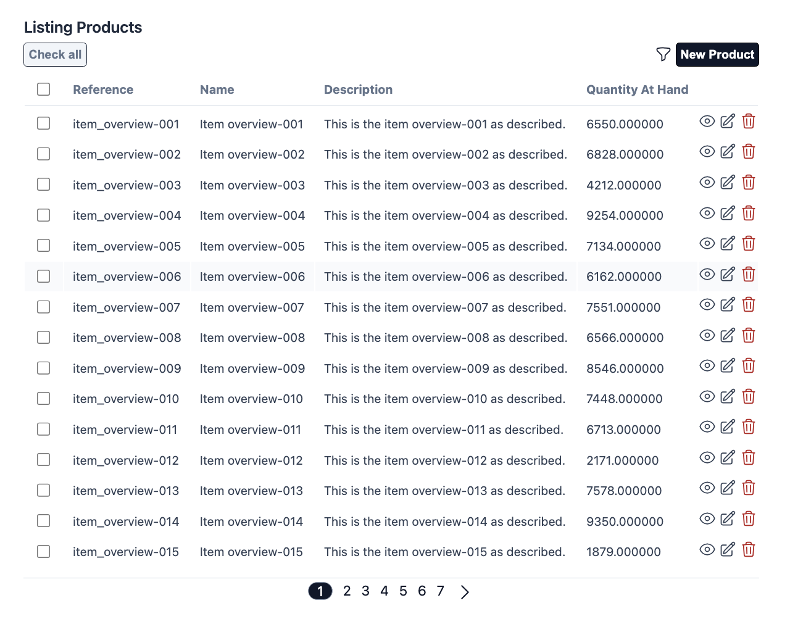
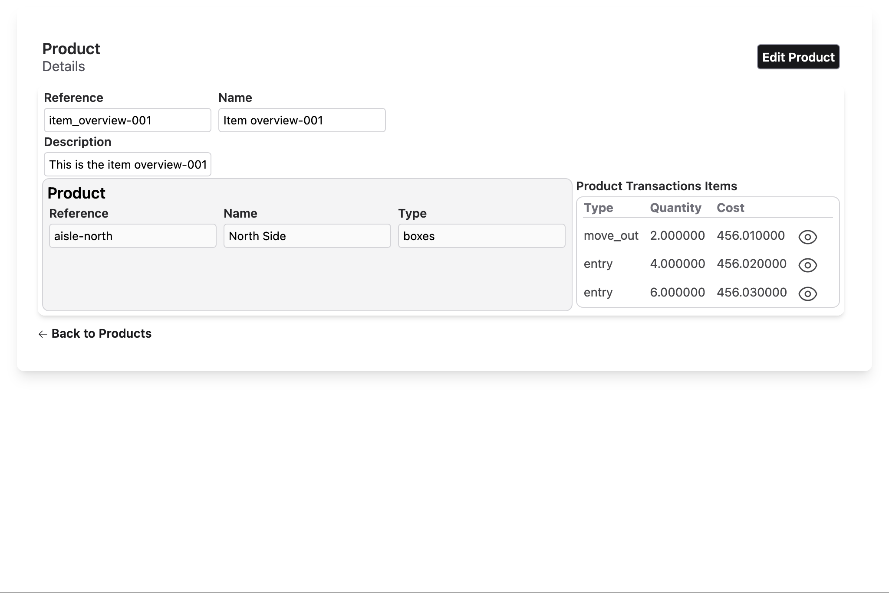
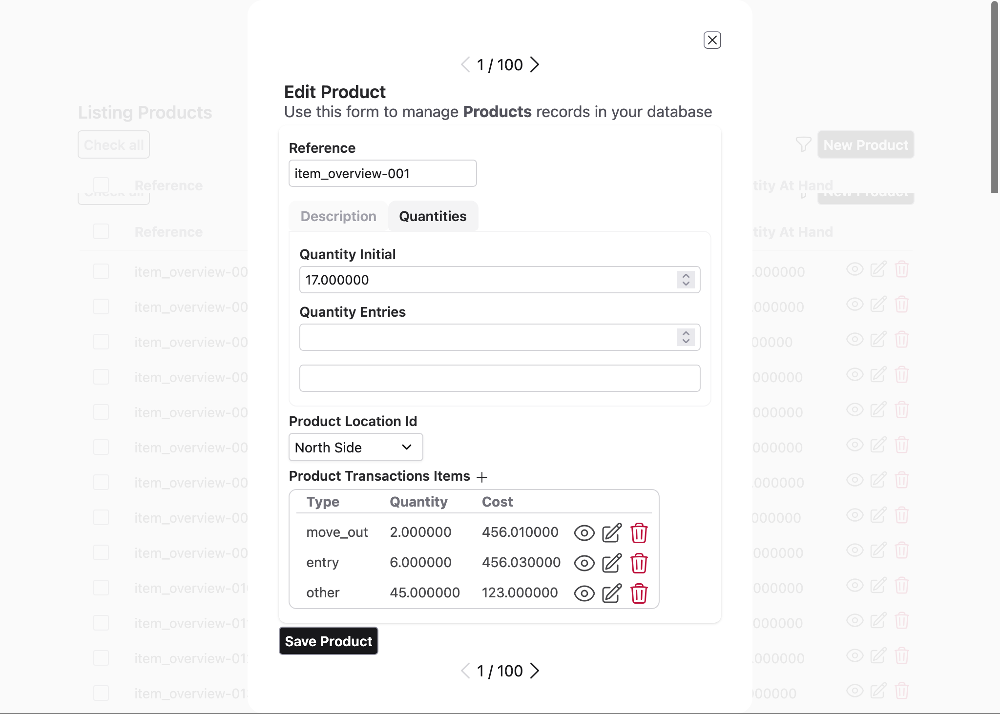
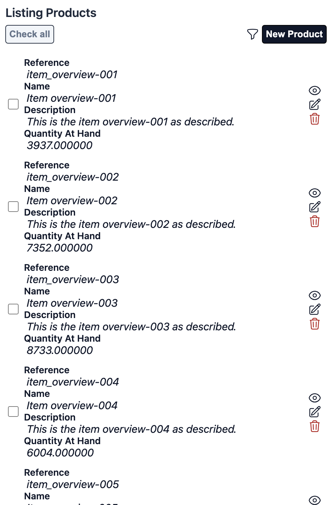
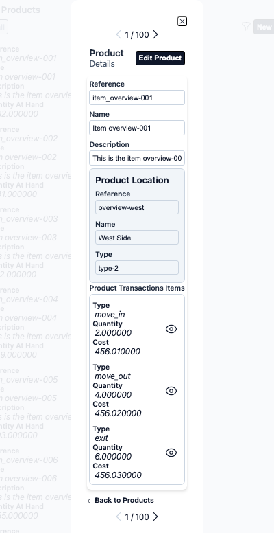
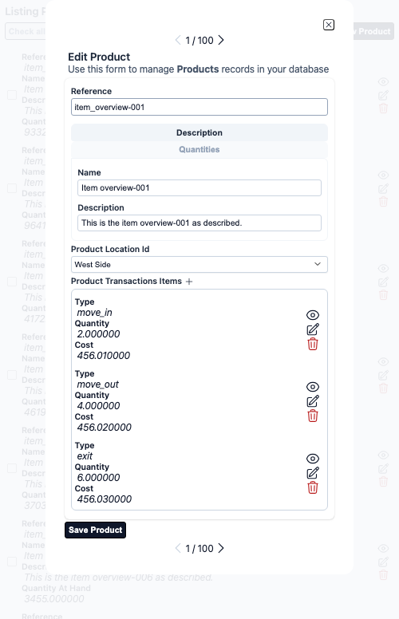
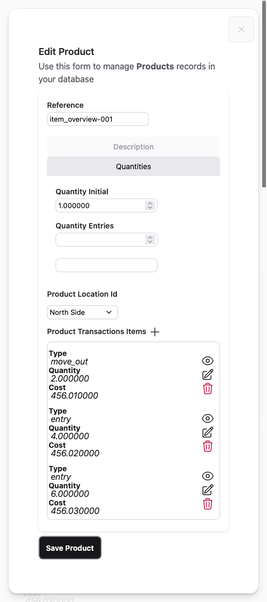

# Aurora UIX

Aurora UIX is a low-code UI framework for the Elixir Phoenix ecosystem, designed to rapidly generate CRUD user interfaces with minimal boilerplate. It leverages resource metadata, a declarative layout DSL, and compile-time code generation to produce maintainable, extensible, and consistent LiveView-based UIs.

## Core Concepts

- **Resource Metadata**: Define schema-based resource UI configuration, 
specifying field-level UI options, associations, and validation rules.
- **Layout DSL**: Compose layouts for forms, lists, and detail views having nested elements like 
groups, stacks, sections, inline.
- **Compile-Time UI Generation**: Aurora UIX generates LiveView modules and HEEx templates at compile time,
ensuring fast runtime performance and type safety.
- **Extensible Templates**: The system supports pluggable template engines and customizable rendering logic, 
allowing for advanced UI customization and integration with custom components.
- **Interchangeable Theme Support**: Comes with light and dark themes, which can be customized or 
replaced completely.

## Features

- Declarative resource and field configuration
- Automatic CRUD UI generation (index, form, show)
- Flexible, composable layouts with grouping and tabbed sections
- Association handling (one_to_many, many_to_one, embeds_one, embeds_many)
- Compile-time generation for minimal runtime overhead
- Extensible template and component system
- Configurable and runtime switchable themes
- Integrated i18n support via configurable Gettext backend

## Example Usage

```elixir
defmodule Aurora.UixWeb.Guides.Overview do
  use Aurora.Uix

  alias Aurora.Uix.Guides.Inventory
  alias Aurora.Uix.Guides.Inventory.Product
  alias Aurora.Uix.Guides.Inventory.ProductLocation
  alias Aurora.Uix.Guides.Inventory.ProductTransaction

  auix_resource_metadata(:product_location, context: Inventory, schema: ProductLocation)

  auix_resource_metadata(:product_transaction, context: Inventory, schema: ProductTransaction)

  auix_resource_metadata(:product, context: Inventory, schema: Product) do
    field(:product_location_id, option_label: :name)
  end

  auix_create_ui do
    index_columns(:product, [:reference, :name, :description, :quantity_at_hand],
      pagination_items_per_page: 15
    )

    index_columns(:product_transaction, [:type, :quantity, :cost])

    edit_layout :product_location do
      inline([:reference, :name, :type])
    end

    show_layout :product do
      stacked do
        inline([:reference, :name])
        inline([:description])
        inline([:product_location, :product_transactions])
      end
    end

    edit_layout :product do
      stacked do
        inline([:reference])

        sections do
          section "Description" do
            stacked([:name, :description])
          end

          section "Quantities" do
            stacked([:quantity_initial, :quantity_entries, :quantities_exits])
          end
        end

        stacked do
          inline([:product_location_id])
          inline([:product_transactions])
        end
      end
    end
  end
end
```

Will produce the whole UI interface for **C**reating, **R**eading (showing), **U**pdating (editing) 
and **D**eleting along with validation, association handling, among other features and functionalities.
Each schema gets its own set of interfaces.
The following images depicts some of the automatically generated UI:

#### Index listing


#### Record showing


#### Record editing


- **Section Switching**



Views are responsive, in a mobile you'll have this:

#### Index listing


#### Record showing


#### Record editing


- **Section Switching**




## When to Use Aurora UIX

- Rapid prototyping of Phoenix CRUD interfaces
- Projects that benefit from convention-over-configuration and consistent UI patterns
- Teams seeking to minimize repetitive UI code and focus on business logic

## Extending Aurora UIX

- Implement custom templates or override rendering logic
- Author custom field renderers or extend the layout DSL
- Integrate with your own Phoenix components and styles

See the guides and documentation for more details on configuration, 
customization, and advanced usage.
