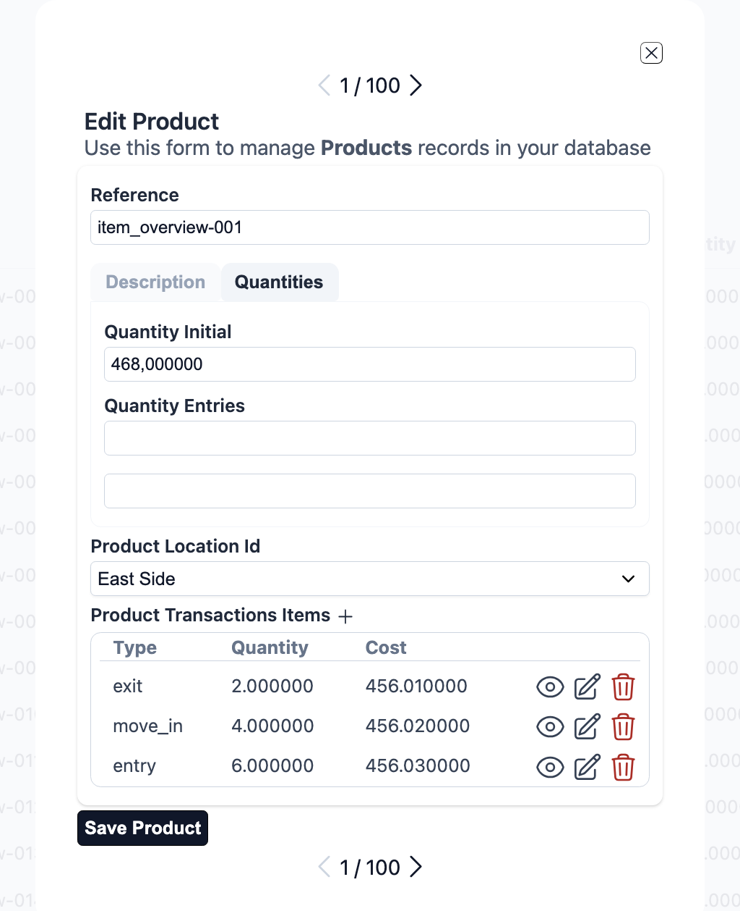
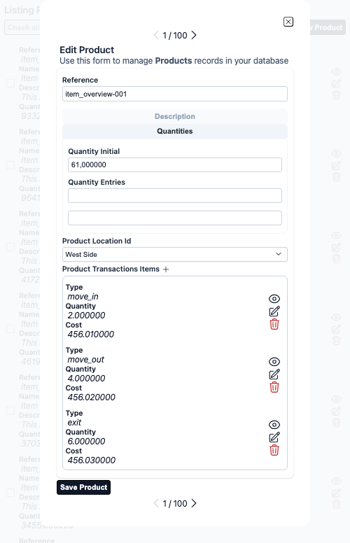

# Aurora UIX Overview

Welcome to **Aurora UIX** — a low-code, metadata-driven UI framework for Elixir's Phoenix ecosystem.

Aurora UIX helps you rapidly generate complete CRUD user interfaces with minimal boilerplate code. By leveraging declarative resource metadata and a powerful layout DSL, you can build feature-rich, maintainable UIs with compile-time code generation and automatic LiveView integration.

## Core Architecture

Aurora UIX is built on three interconnected components:

### 1. Resource Metadata
Define UI configuration declaratively using the `auix_resource_metadata/3` macro. Specify field-level options, validation rules, labels, and association handling all in one place.

```elixir
auix_resource_metadata :product, context: Inventory, schema: Product do
  field :name, placeholder: "Product name", required: true
  field :price, precision: 12, scale: 2
end
```

### 2. Layout DSL
Compose complex, nested layouts for index, show, and edit views using a flexible declarative syntax. Combine layout elements like `inline`, `stacked`, and `sections` to organize your UI.

```elixir
show_layout :product do
  stacked do
    inline [:name, :price]
    sections do
      section "Details" do
        stacked [:description, :category]
      end
    end
  end
end
```

### 3. Compile-Time Code Generation
Aurora UIX generates optimized LiveView modules and HEEx templates at compile time, not runtime. This ensures fast performance, type safety, and maintainable code.

## Key Features

- **Multiple Backend Support** - Works seamlessly with Ecto schemas and Ash Framework resources through automatic adapter detection
- **Declarative Configuration** - Define resources and layouts as Elixir code, no templates to manage
- **Automatic CRUD UIs** - Generate complete Create, Read, Update, Delete interfaces automatically
- **Association Support** - Built-in handling for `belongs_to`, `has_many`, `embeds_one`, and `embeds_many`
- **Responsive Design** - Layouts work seamlessly on desktop and mobile devices
- **Customizable Themes** - Includes light and dark themes, fully customizable or replaceable
- **Extensible** - Override templates, create custom renderers, integrate custom components
- **Minimal Overhead** - Compile-time generation means fast runtime performance

## Complete Example

Here's a example showing Resource Metadata and Layout DSL working together to create a complete inventory management interface:

```elixir
defmodule MyAppWeb.InventoryViews do
  use Aurora.Uix

  alias MyApp.Inventory
  alias MyApp.Inventory.{Product, ProductLocation, ProductTransaction}

  # Define UI metadata for each resource
  auix_resource_metadata(:product_location, context: Inventory, schema: ProductLocation)

  auix_resource_metadata(:product_transaction, context: Inventory, schema: ProductTransaction)

  auix_resource_metadata(:product, context: Inventory, schema: Product) do
    field :name, placeholder: "Product name", required: true
    field :price, precision: 12, scale: 2
  end

  # Define layouts for each view
  auix_create_ui do
    # Index view configuration
    index_columns :product, [:reference, :name, :price, :quantity_at_hand],
      pagination_items_per_page: 15

    # Show view configuration
    show_layout :product do
      stacked do
        inline [:reference, :name]
        inline [:description]
        inline [:price, :quantity_at_hand]
        inline [:product_location, :product_transactions]
      end
    end

    # Edit view configuration with organized sections
    edit_layout :product do
      stacked do
        inline [:reference]
        sections do
          section "Basic Information" do
            stacked [:name, :description]
          end
          section "Pricing" do
            stacked [:price, :cost]
          end
          section "Inventory" do
            stacked [:quantity_initial, :quantity_entries]
          end
        end
        inline [:product_location_id]
      end
    end
  end
end
```

**Result**: A complete product management interface with:
- ✅ Responsive list view with pagination
- ✅ Detailed product view with organized sections
- ✅ Editable form with grouped fields
- ✅ Association handling (location selection, transaction links)
- ✅ Automatic validation and error handling
- ✅ Real-time updates via LiveView

## Generated UI Examples

Aurora UIX generates complete, responsive CRUD interfaces. Here are examples of automatically generated interfaces:

### Desktop Views

<!-- Screenshot captured in test server, or phx.server URL: guides-overview/products -->
#### List View (Paginated Index)
<div align="center">
    
</div>

#### Detail View (Show)
<div align="center">
    
</div>

#### Edit View with Sections
<div align="center">
    
</div>

#### Section Navigation
<div align="center">
    
</div>

### Mobile Views

Aurora UIX layouts are fully responsive and adapt to mobile devices:

#### Mobile List View (Infinite Scroll)
<div align="center">
    
</div>
#### Mobile Detail View (Show)
<div align="center">
    
</div>

#### Mobile Edit View with Sections
<div align="center">
    
</div>

#### Mobile Section Navigation
<div align="center">
    
</div>


## Who Should Use Aurora UIX?

Aurora UIX is ideal for:

- **Rapid Prototyping** - Build CRUD interfaces in minutes, not days
- **Internal Tools & Admin Panels** - Generate admin interfaces for business logic
- **MVP Development** - Focus on business logic, not UI boilerplate
- **Data Management Apps** - Applications centered around data entry and management
- **Convention-Driven Teams** - Teams that value consistency and predictable patterns

Aurora UIX works best when:
- Your primary need is CRUD operations with standard UI patterns
- You want to minimize repetitive form and list code
- Consistency across the application is important
- You want compile-time safety and performance

Aurora UIX is built to be extensible:

- **Custom Field Renderers** - Implement custom rendering logic for specialized fields
- **Layout Components** - Create reusable layout compositions
- **Custom Templates** - Override the default template system
- **Theme Customization** - Modify existing themes or create new ones from scratch
- **LiveView Integration** - Hook into LiveView events for business logic

## Documentation & Next Steps

### Getting Started

Ready to build your first Aurora UIX interface? Follow these steps:

1. **[Getting Started Guide](../introduction/getting_started.md)** - 10-minute setup and first CRUD interface
2. **[Resource Metadata Guide](../core/resource_metadata.md)** - Learn how to configure resources
3. **[Layout System Guide](../core/layouts.md)** - Get to know the layout DSL

### Customization & Extension

For details on advanced customization, see:

- **[Advanced Usage Guide](../advanced/advanced_usage.md)**
- **[LiveView Integration](../core/liveview.md)**

### Troubleshooting

Guide for tackling known issues and corner cases:

- **[Troubleshooting](../advanced/troubleshooting.md)**

